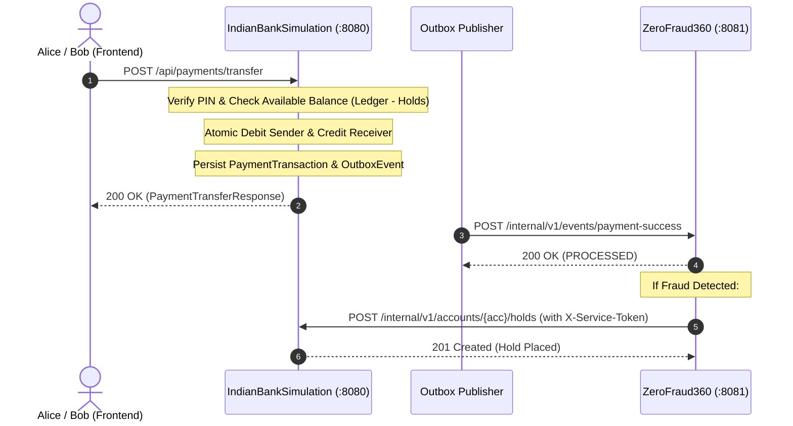

# IndianBankSimulation — API Endpoints Reference

> **Core Banking & Payment Simulation REST API Specification**  
> **Service Port**: `8080`  
> **Base URL**: `http://localhost:8080`  
> **Database**: `banksim_db` (MySQL)  
> **Framework**: Spring Boot 3 + Spring Security + JPA / Hibernate

---

## Table of Contents

1. [Service Architecture](#1-service-architecture)
2. [Configuration & Environment Variables](#2-configuration--environment-variables)
3. [Pre-Seeded Test Personas & Accounts](#3-pre-seeded-test-personas--accounts)
4. [Request Headers & Security Boundaries](#4-request-headers--security-boundaries)
5. [Standard Error Envelope (`ApiErrorResponse`)](#5-standard-error-envelope-apierrorresponse)
6. [API Endpoints Reference](#6-api-endpoints-reference)
   - [Authentication APIs (`/api/auth/**`)](#61-authentication-apis)
   - [Account & Balance APIs (`/api/accounts/**`)](#62-account--balance-apis)
   - [Payment Transfer APIs (`/api/payments/**`)](#63-payment-transfer-apis)
   - [Internal Account Hold APIs (`/internal/v1/**`)](#64-internal-account-hold-apis)
7. [Outbox Event Publisher (`PAYMENT_SUCCESS`)](#7-outbox-event-publisher-payment_success)
8. [cURL Testing & Verification Guide](#8-curl-testing--verification-guide)

---

## 1. Service Architecture

`IndianBankSimulation` simulates an inter-bank payment and core banking network:
- **Ledger Accounts**: Double-entry ledger balances for multiple simulated banks (`BANK_A`, `BANK_B`).
- **Payment Processing**: Atomic debit/credit across accounts with UPI PIN verification and available balance validation.
- **Fund Holds**: Internal hold subsystem that freezes funds on suspected fraudulent accounts without modifying ledger transactions.
- **Transactional Outbox**: Guaranteed at-least-once event delivery of successful transactions to fraud detection listeners (`ZeroFraud360`).



---

## 2. Configuration & Environment Variables

Key configuration properties located in `src/main/resources/application.yml`:

| Property / Env Variable | Default Value | Description |
| :--- | :--- | :--- |
| `server.port` | `8080` | HTTP listening port |
| `DB_URL` | `jdbc:mysql://localhost:3306/banksim_db` | MySQL connection string |
| `DB_USERNAME` | `root` | MySQL username |
| `DB_PASSWORD` | `root` | MySQL password |
| `JWT_SECRET` | 256-bit Hex Key | HMAC-SHA256 secret for customer JWT tokens |
| `app.jwt.expiration-ms` | `86400000` (24 hours) | Token validity duration |
| `BANK_SIMULATION_SERVICE_TOKEN` | `sim-secret-token-360` | Shared secret token required for `/internal/v1/**` APIs |
| `ZERO_FRAUD_EVENTS_URL` | `http://localhost:8081/internal/v1/events/payment-success` | Target URL for outbox event publishing |
| `bank.holds.expiration-check-interval-ms`| `15000` (15s) | Background scheduler interval to expire aged holds |

---

## 3. Pre-Seeded Test Personas & Accounts

Pre-populated in Flyway migration scripts:

| Persona | Bank Code | Username | Password | Role | Account Number | IFSC | Initial Balance | UPI ID | UPI PIN |
| :--- | :--- | :--- | :--- | :--- | :--- | :--- | :--- | :--- | :--- |
| **Alice Sharma** | `BANK_A` | `alice` | `Password@123` | `ROLE_CUSTOMER` | `1000000001` | `SIMU000001` | ₹50,000.00 | `alice@bankA` | `123456` |
| **Bob Verma** | `BANK_B` | `bob` | `Password@123` | `ROLE_CUSTOMER` | `2000000001` | `SIMU000002` | ₹10,000.00 | `bob@bankB` | `654321` |
| **System Admin** | `CORE` | `admin` | `Admin@123` | `ROLE_ADMIN` | *N/A* | *N/A* | *N/A* | *N/A* | *N/A* |

> [!NOTE]
> All passwords and UPI PINs are hashed using BCrypt (`$2a$10$...`). Raw PINs and hashes are **strictly never returned** in API responses.

---

## 4. Request Headers & Security Boundaries

| Header | Description | Required On | Example |
| :--- | :--- | :--- | :--- |
| `Content-Type` | Payload format | All POST/PUT requests | `application/json` |
| `Authorization` | Bearer JWT token | Protected customer APIs (`/api/accounts/**`, `/api/auth/me`) | `Bearer eyJhbGciOi...` |
| `X-Service-Token` | Shared machine-to-machine secret | Internal APIs (`/internal/v1/**`) | `sim-secret-token-360` |
| `X-Correlation-Id` | Distributed request tracing ID | Optional (generated automatically if omitted) | `CORR-be9cc404-8a05-...` |

---

## 5. Standard Error Envelope (`ApiErrorResponse`)

All error responses adhere to this unified JSON structure:

```json
{
  "timestamp": "2026-09-10T06:15:30.123Z",
  "status": 400,
  "code": "VALIDATION_FAILED",
  "message": "Request validation failed.",
  "correlationId": "CORR-8b7e2e9c-34d2-45af-bc74-6380629a4358",
  "transactionId": null,
  "fieldErrors": {
    "senderAccountNumber": "senderAccountNumber is required",
    "amount": "amount must be greater than 0"
  }
}
```

### Common Error Codes

| Error Code | HTTP Status | Description |
| :--- | :--- | :--- |
| `INVALID_CREDENTIALS` | `401 Unauthorized` | Invalid username or password |
| `INVALID_PIN` | `401 Unauthorized` | Incorrect UPI PIN entered |
| `ACCESS_DENIED` | `403 Forbidden` | Missing token or invalid `X-Service-Token` |
| `FORBIDDEN_ACCOUNT_ACCESS`| `403 Forbidden` | Authenticated user is not the owner of requested account |
| `RESOURCE_NOT_FOUND` | `404 Not Found` | Sender/receiver account or hold ID does not exist |
| `VALIDATION_FAILED` | `400 Bad Request` | Request payload failed schema validation |
| `INSUFFICIENT_AVAILABLE_FUNDS` | `400 Bad Request` | Ledger balance minus active holds is insufficient |
| `ACCOUNT_INACTIVE` | `400 Bad Request` | Account status is frozen or inactive |
| `DUPLICATE_RESOURCE` | `409 Conflict` | Username or email already registered |
| `INTERNAL_ERROR` | `500 Internal Server Error` | Unexpected runtime error |

---

## 6. API Endpoints Reference

### 6.1 Authentication APIs

---

#### `POST /api/auth/login`
- **Description**: Authenticates bank customers using username and password. Returns a signed JWT token valid for 24 hours.
- **Access**: Public
- **Headers**:
  ```http
  Content-Type: application/json
  ```
- **Request Body**:
  ```json
  {
    "username": "alice",
    "password": "Password@123"
  }
  ```
- **Validation Rules**:
  - `username`: Not blank
  - `password`: Not blank
- **Response `200 OK`**:
  ```json
  {
    "accessToken": "eyJhbGciOiJIUzI1NiJ9.eyJzdWIiOiJhbGljZSIs...",
    "tokenType": "Bearer",
    "expiresInMs": 86400000,
    "userId": 1,
    "username": "alice",
    "roles": [
      "ROLE_CUSTOMER"
    ]
  }
  ```
- **Errors**:
  - `401 Unauthorized` (`INVALID_CREDENTIALS`): Bad credentials.
  - `400 Bad Request` (`VALIDATION_FAILED`): Missing username or password.
- **cURL Example**:
  ```bash
  curl -X POST http://localhost:8080/api/auth/login \
    -H "Content-Type: application/json" \
    -d '{"username":"alice","password":"Password@123"}'
  ```

---

#### `POST /api/auth/register`
- **Description**: Registers a new customer and initializes their user record.
- **Access**: Public
- **Headers**:
  ```http
  Content-Type: application/json
  ```
- **Request Body**:
  ```json
  {
    "username": "charlie",
    "email": "charlie@banka.sim",
    "password": "Password@123",
    "fullName": "Charlie Singh",
    "mobileNumber": "9876543299"
  }
  ```
- **Validation Rules**:
  - `username`: 3–50 characters, not blank
  - `email`: Valid email format, not blank
  - `password`: Minimum 6 characters, not blank
  - `fullName`: Not blank
  - `mobileNumber`: 10-digit Indian mobile number (`^[6-9]\d{9}$`)
- **Response `201 Created`**:
  ```json
  {
    "accessToken": "eyJhbGciOiJIUzI1NiJ9...",
    "tokenType": "Bearer",
    "expiresInMs": 86400000,
    "userId": 4,
    "username": "charlie",
    "roles": [
      "ROLE_CUSTOMER"
    ]
  }
  ```
- **Errors**:
  - `409 Conflict` (`DUPLICATE_RESOURCE`): Username or email already registered.
  - `400 Bad Request` (`VALIDATION_FAILED`): Field validation errors.

---

#### `GET /api/auth/me`
- **Description**: Retrieves the authenticated customer's profile information.
- **Access**: Protected (`ROLE_CUSTOMER` or `ROLE_ADMIN`)
- **Headers**:
  ```http
  Authorization: Bearer <CUSTOMER_JWT_TOKEN>
  ```
- **Response `200 OK`**:
  ```json
  {
    "userId": 1,
    "username": "alice",
    "email": "alice@banka.sim",
    "fullName": "Alice Sharma",
    "mobileNumber": "9876543210",
    "roles": [
      "ROLE_CUSTOMER"
    ]
  }
  ```
- **cURL Example**:
  ```bash
  curl -X GET http://localhost:8080/api/auth/me \
    -H "Authorization: Bearer <CUSTOMER_JWT_TOKEN>"
  ```

---

### 6.2 Account & Balance APIs

---

#### `GET /api/accounts/me`
- **Description**: Lists all accounts owned by the authenticated customer. Never exposes raw PINs or PIN hash values.
- **Access**: Protected (`ROLE_CUSTOMER`)
- **Headers**:
  ```http
  Authorization: Bearer <CUSTOMER_JWT_TOKEN>
  ```
- **Response `200 OK`**:
  ```json
  [
    {
      "id": 1,
      "accountNumber": "1000000001",
      "ifsc": "SIMU000001",
      "bankCode": "BANK_A",
      "bankName": "Bank of Simulation A",
      "customerName": "Alice Sharma",
      "currency": "INR",
      "status": "ACTIVE",
      "availableBalance": 50000.0000,
      "upiId": "alice@bankA"
    }
  ]
  ```
- **cURL Example**:
  ```bash
  curl -X GET http://localhost:8080/api/accounts/me \
    -H "Authorization: Bearer <CUSTOMER_JWT_TOKEN>"
  ```

---

#### `GET /api/accounts/me/balance`
- **Description**: Lightweight balance inquiry for the customer's primary account.
- **Access**: Protected (`ROLE_CUSTOMER`)
- **Headers**:
  ```http
  Authorization: Bearer <CUSTOMER_JWT_TOKEN>
  ```
- **Response `200 OK`**:
  ```json
  {
    "accountNumber": "1000000001",
    "upiId": "alice@bankA",
    "currency": "INR",
    "availableBalance": 50000.0000
  }
  ```
- **cURL Example**:
  ```bash
  curl -X GET http://localhost:8080/api/accounts/me/balance \
    -H "Authorization: Bearer <CUSTOMER_JWT_TOKEN>"
  ```

---

#### `GET /api/accounts/{accountNumber}`
- **Description**: Fetches detailed account information for a specified account number. Validates that the requesting user owns the account.
- **Access**: Protected (`ROLE_CUSTOMER` owner)
- **Path Variable**: `accountNumber` — Target bank account number (e.g. `1000000001`)
- **Headers**:
  ```http
  Authorization: Bearer <CUSTOMER_JWT_TOKEN>
  ```
- **Response `200 OK`**:
  ```json
  {
    "id": 1,
    "accountNumber": "1000000001",
    "ifsc": "SIMU000001",
    "bankCode": "BANK_A",
    "bankName": "Bank of Simulation A",
    "customerName": "Alice Sharma",
    "currency": "INR",
    "status": "ACTIVE",
    "availableBalance": 50000.0000,
    "upiId": "alice@bankA"
  }
  ```
- **Errors**:
  - `403 Forbidden` (`FORBIDDEN_ACCOUNT_ACCESS`): User is not the owner.
  - `404 Not Found` (`RESOURCE_NOT_FOUND`): Account does not exist.

---

### 6.3 Payment Transfer APIs

---

#### `POST /api/payments/transfer`
- **Description**: Executes an atomic funds transfer between two accounts.
  - Validates sender and receiver accounts exist and are `ACTIVE`.
  - Optionally verifies `upiPin` against BCrypt hash.
  - Computes available balance: $\text{Available} = \text{Ledger Balance} - \sum \text{Active Holds}$.
  - Debits sender and credits receiver in an atomic transaction.
  - Generates payment transaction record and writes `PAYMENT_SUCCESS` outbox event.
- **Access**: Public / Simulation UI
- **Headers**:
  ```http
  Content-Type: application/json
  ```
- **Request Body**:
  ```json
  {
    "senderAccountNumber": "1000000001",
    "receiverAccountNumber": "2000000001",
    "amount": 10000.00,
    "currency": "INR",
    "upiPin": "123456",
    "paymentRail": "SIMULATED_UPI",
    "messageId": "MSG-00123",
    "occurredAt": "2026-09-10T06:30:00Z"
  }
  ```
- **Field Constraints**:
  - `senderAccountNumber` (Required): Debiting account number.
  - `receiverAccountNumber` (Required): Crediting account number.
  - `amount` (Required): Decimal value $\ge 0.01$.
  - `currency` (Optional, default `INR`): Currency string.
  - `upiPin` (Optional): 6-digit PIN.
  - `paymentRail` (Optional, default `SIMULATED_UPI`): `SIMULATED_UPI`, `IMPS`, `NEFT`, `RTGS`.
  - `messageId` (Optional): Unique message tracking ID.
  - `occurredAt` (Optional): ISO-8601 timestamp.
- **Response `200 OK`**:
  ```json
  {
    "transactionId": "TXN-B7E2E9C34D",
    "senderAccountNumber": "1000000001",
    "receiverAccountNumber": "2000000001",
    "amount": 10000.00,
    "currency": "INR",
    "status": "SUCCESS",
    "occurredAt": "2026-09-10T06:30:00Z"
  }
  ```
- **Errors**:
  - `400 Bad Request` (`INSUFFICIENT_AVAILABLE_FUNDS`): Available balance is less than transfer amount.
  - `400 Bad Request` (`ACCOUNT_INACTIVE`): Sender or receiver account is disabled.
  - `401 Unauthorized` (`INVALID_PIN`): UPI PIN does not match.
  - `404 Not Found` (`RESOURCE_NOT_FOUND`): Sender or receiver account number not found.
- **cURL Example**:
  ```bash
  curl -X POST http://localhost:8080/api/payments/transfer \
    -H "Content-Type: application/json" \
    -d '{
      "senderAccountNumber": "1000000001",
      "receiverAccountNumber": "2000000001",
      "amount": 10000.00,
      "currency": "INR",
      "upiPin": "123456",
      "paymentRail": "SIMULATED_UPI"
    }'
  ```

---

#### `POST /internal/v1/payments/transfer`
- **Description**: Internal machine-to-machine transfer endpoint for test harnesses and external simulation agents.
- **Access**: Internal trusted service (`ROLE_TRUSTED_SERVICE` / `X-Service-Token`)
- **Headers**:
  ```http
  Content-Type: application/json
  X-Service-Token: sim-secret-token-360
  ```
- **Request / Response**: Identical schema to `POST /api/payments/transfer`.

---

### 6.4 Internal Account Hold APIs

> [!IMPORTANT]
> All `/internal/v1/**` endpoints require the internal service header:  
> `X-Service-Token: sim-secret-token-360`  
> Direct calls from browsers or without this valid token are rejected with `403 Forbidden`.

---

#### `POST /internal/v1/accounts/{accountId}/holds`
- **Description**: Places a temporary fund hold on the specified bank account. This reduces the available balance to prevent withdrawal or onward transfer without altering the ledger balance.
- **Access**: Trusted Service (`X-Service-Token` required)
- **Path Variable**: `accountId` — Target account number (e.g. `2000000001`)
- **Headers**:
  ```http
  Content-Type: application/json
  X-Service-Token: sim-secret-token-360
  ```
- **Request Body**:
  ```json
  {
    "requestId": "HOLD-REQ-001",
    "transactionId": "TXN-B7E2E9C34D",
    "alertId": "ALERT-D683707CA9",
    "amount": 10000.00,
    "currency": "INR",
    "durationMinutes": 10,
    "reasonCode": "RAPID_PASS_THROUGH_SUSPECTED",
    "source": "ZERO_FRAUD_360"
  }
  ```
- **Fields Reference**:
  - `requestId` (Required): Deduplication and tracking ID for the hold request.
  - `transactionId` (Optional): Associated transaction that triggered the hold.
  - `alertId` (Optional): Originating fraud alert ID.
  - `amount` (Required): Amount to freeze (decimal $\ge 0.01$).
  - `currency` (Optional, default `INR`): Currency code.
  - `durationMinutes` (Optional, default `10`): Minutes until automatic hold expiration.
  - `reasonCode` (Optional): Internal categorization code.
  - `source` (Optional): Requesting system name (`ZERO_FRAUD_360`).
- **Response `201 Created`**:
  ```json
  {
    "holdId": "HOLD-6F7E8D9C0A",
    "accountId": "2000000001",
    "amount": 10000.00,
    "status": "ACTIVE",
    "expiresAt": "2026-09-10T06:40:00Z"
  }
  ```
- **cURL Example**:
  ```bash
  curl -X POST http://localhost:8080/internal/v1/accounts/2000000001/holds \
    -H "Content-Type: application/json" \
    -H "X-Service-Token: sim-secret-token-360" \
    -d '{
      "requestId": "HOLD-REQ-001",
      "transactionId": "TXN-B7E2E9C34D",
      "alertId": "ALERT-D683707CA9",
      "amount": 10000.00,
      "currency": "INR",
      "durationMinutes": 10,
      "reasonCode": "RAPID_PASS_THROUGH_SUSPECTED",
      "source": "ZERO_FRAUD_360"
    }'
  ```

---

#### `POST /internal/v1/holds/{holdId}/release`
- **Description**: Releases an active hold on funds, immediately restoring the customer's available balance.
- **Access**: Trusted Service (`X-Service-Token` required)
- **Path Variable**: `holdId` — Unique hold identifier (e.g. `HOLD-6F7E8D9C0A`)
- **Headers**:
  ```http
  Content-Type: application/json
  X-Service-Token: sim-secret-token-360
  ```
- **Request Body** *(Optional)*:
  ```json
  {
    "officerId": "police",
    "reason": "Customer identity verified; transfer cleared"
  }
  ```
- **Response `200 OK`**:
  ```json
  {
    "holdId": "HOLD-6F7E8D9C0A",
    "accountId": "2000000001",
    "transactionId": "TXN-B7E2E9C34D",
    "alertId": "ALERT-D683707CA9",
    "amount": 10000.00,
    "currency": "INR",
    "reasonCode": "RAPID_PASS_THROUGH_SUSPECTED",
    "source": "ZERO_FRAUD_360",
    "status": "RELEASED",
    "createdAt": "2026-09-10T06:30:00Z",
    "expiresAt": "2026-09-10T06:40:00Z",
    "releasedAt": "2026-09-10T06:35:12Z",
    "releaseReason": "Customer identity verified; transfer cleared"
  }
  ```
- **cURL Example**:
  ```bash
  curl -X POST http://localhost:8080/internal/v1/holds/HOLD-6F7E8D9C0A/release \
    -H "Content-Type: application/json" \
    -H "X-Service-Token: sim-secret-token-360" \
    -d '{
      "officerId": "police",
      "reason": "Customer identity verified; transfer cleared"
    }'
  ```

---

#### `GET /internal/v1/holds/{holdId}`
- **Description**: Fetches current status, metadata, and lifecycle timestamps for a specific hold.
- **Access**: Trusted Service (`X-Service-Token` required)
- **Path Variable**: `holdId` — Hold identifier
- **Headers**:
  ```http
  X-Service-Token: sim-secret-token-360
  ```
- **Response `200 OK`**: `HoldResponseDto` object (matches structure above).
- **Errors**: `404 Not Found` if hold ID does not exist.
- **cURL Example**:
  ```bash
  curl -X GET http://localhost:8080/internal/v1/holds/HOLD-6F7E8D9C0A \
    -H "X-Service-Token: sim-secret-token-360"
  ```

---

## 7. Outbox Event Publisher (`PAYMENT_SUCCESS`)

Whenever a payment completes successfully, an outbox event is persisted to `outbox_events`. A background scheduler (`OutboxPublisher`) polls and posts the event to ZeroFraud360:

- **Destination**: `${ZERO_FRAUD_EVENTS_URL:http://localhost:8081/internal/v1/events/payment-success}`
- **Payload Schema**:
  ```json
  {
    "eventId": "EVT-C3D4E5F6A1",
    "eventType": "PAYMENT_SUCCESS",
    "transactionId": "TXN-B7E2E9C34D",
    "occurredAt": "2026-09-10T06:30:00Z",
    "sender": {
      "accountId": "ACC-1000000001",
      "accountNumber": "1000000001",
      "bankId": "BANK_A"
    },
    "receiver": {
      "accountId": "ACC-2000000001",
      "accountNumber": "2000000001",
      "bankId": "BANK_B"
    },
    "amount": 10000.00,
    "currency": "INR",
    "paymentRail": "SIMULATED_UPI",
    "correlationId": "CORR-8b7e2e9c...",
    "messageId": "MSG-00123"
  }
  ```

---

## 8. cURL Testing & Verification Guide

### Step 1: Customer Login
```bash
TOKEN=$(curl -s -X POST http://localhost:8080/api/auth/login \
  -H "Content-Type: application/json" \
  -d '{"username":"alice","password":"Password@123"}' | jq -r '.accessToken')
echo "Alice Token: $TOKEN"
```

### Step 2: Check Balance
```bash
curl -s -X GET http://localhost:8080/api/accounts/me/balance \
  -H "Authorization: Bearer $TOKEN" | jq .
```

### Step 3: Transfer Funds
```bash
curl -s -X POST http://localhost:8080/api/payments/transfer \
  -H "Content-Type: application/json" \
  -d '{
    "senderAccountNumber": "1000000001",
    "receiverAccountNumber": "2000000001",
    "amount": 5000.00,
    "currency": "INR",
    "upiPin": "123456",
    "paymentRail": "SIMULATED_UPI"
  }' | jq .
```

### Step 4: Place Internal Hold (Service Token)
```bash
curl -s -X POST http://localhost:8080/internal/v1/accounts/2000000001/holds \
  -H "Content-Type: application/json" \
  -H "X-Service-Token: sim-secret-token-360" \
  -d '{
    "requestId": "TEST-HOLD-001",
    "amount": 5000.00,
    "currency": "INR",
    "durationMinutes": 10,
    "reasonCode": "MANUAL_TEST",
    "source": "CLI_TEST"
  }' | jq .
```
