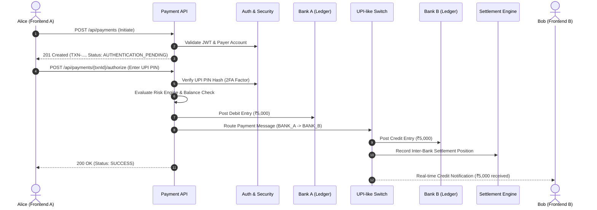

# Indian Banking & Payment-System Simulation — IndianBankSimulation

> [!IMPORTANT]
> **Educational Simulation Notice**
> This repository is an educational simulation of architectural concepts used in Indian digital banking and payment systems.
> 
> It is **NOT** connected to NPCI, RBI, UPI, IMPS, NEFT, RTGS, or any real bank and does not implement their proprietary production protocols, private message formats, or cryptographic hardware security module (HSM) internals.
> 
> The project models publicly documented architectural concepts: customer authentication, transaction authorization, append-only ledgers, inter-bank routing, settlement positions, reconciliation, idempotency, retries, auditability, and failure handling.

---

## 1. System Overview & Architecture

The application simulates an inter-bank payment network where two simulated banks (**Bank A** and **Bank B**) interact through an educational payment switch. Two frontend users (Alice and Bob) have accounts in separate banks and can transfer funds in real-time.



---

## 2. Seeded Test Personas & Accounts

The database is pre-seeded with two bank accounts and users ready for instant testing:

| Customer | Bank | Username | Password | Account Number | IFSC | UPI ID (VPA) | Initial Balance | UPI PIN | Role |
| :--- | :--- | :--- | :--- | :--- | :--- | :--- | :--- | :--- | :--- |
| **Alice Sharma** | Bank A (`BANK_A`) | `alice` | `Password@123` | `1000000001` | `SIMU000001` | `alice@bankA` | ₹50,000.00 | `123456` | `ROLE_CUSTOMER` |
| **Bob Verma** | Bank B (`BANK_B`) | `bob` | `Password@123` | `2000000001` | `SIMU000002` | `bob@bankB` | ₹10,000.00 | `654321` | `ROLE_CUSTOMER` |
| **System Admin** | Core | `admin` | `Admin@123` | *N/A* | *N/A* | *N/A* | *N/A* | *N/A* | `ROLE_ADMIN` |

> [!NOTE]
> All passwords and UPI PINs are hashed using BCrypt (`$2a$10$...`). Raw PINs and hashes are **strictly never returned** in API responses.

---

## 3. Frontend Integration Standards

### 3.1 Base URL
```text
http://localhost:8080
```

### 3.2 Common Request Headers
| Header | Description | Required | Example |
| :--- | :--- | :--- | :--- |
| `Content-Type` | MIME type for payload | Yes (for POST/PUT) | `application/json` |
| `Authorization` | JWT Bearer authentication | Yes (protected endpoints) | `Bearer eyJhbGciOi...` |
| `X-Correlation-Id` | Distributed request tracing ID | Optional (generated if missing) | `CORR-8b7e2e9c-...` |
| `Idempotency-Key` | Ensures payments are never duplicated on retries | Mandatory on payment creation | `uuidv4()` e.g. `9b1deb4d-3b7d-4bad-9bdd-2b0d7b3dcb6d` |

### 3.3 Standard Response Headers
Every API response returns:
- `X-Correlation-Id`: The correlation identifier associated with the request and internal log events.

### 3.4 Standard Error Response Format
All errors (4xx and 5xx) adhere to this unified JSON structure:
```json
{
  "timestamp": "2026-09-09T15:03:46.693Z",
  "status": 403,
  "code": "FORBIDDEN_ACCOUNT_ACCESS",
  "message": "You are not authorized to view account 1000000001",
  "correlationId": "CORR-be9cc404-8a05-4c87-a550-9c03375cf79a",
  "transactionId": null,
  "fieldErrors": null
}
```

When form/request validation fails (HTTP 400), `fieldErrors` contains field-level messages:
```json
{
  "timestamp": "2026-09-09T15:05:12.112Z",
  "status": 400,
  "code": "VALIDATION_FAILED",
  "message": "Request validation failed.",
  "correlationId": "CORR-74ac38c8-25e2-4210-b567-69ec57373bd6",
  "fieldErrors": {
    "username": "Username must be between 3 and 50 characters",
    "password": "Password must be at least 6 characters"
  }
}
```

---

## 4. Complete REST API Reference

### 4.1 Authentication & Profile APIs

#### `POST /api/auth/login`
Authenticates a user and returns a signed JWT token.
- **Access**: Public
- **Action**: Verifies username and BCrypt password hash. Returns access token valid for 24 hours.
- **Request Body**:
  ```json
  {
    "username": "alice",
    "password": "Password@123"
  }
  ```
- **Response `200 OK`**:
  ```json
  {
    "accessToken": "eyJhbGciOiJIUzI1NiJ9...",
    "tokenType": "Bearer",
    "expiresInMs": 86400000,
    "userId": 1,
    "username": "alice",
    "roles": ["ROLE_CUSTOMER"]
  }
  ```
- **Errors**: `401 Unauthorized` (`INVALID_CREDENTIALS`), `400 Bad Request` (`VALIDATION_FAILED`).

---

#### `POST /api/auth/register`
Registers a new customer and user profile.
- **Access**: Public
- **Action**: Creates a `User` entity with `ROLE_CUSTOMER` and an associated `Customer` profile entity.
- **Request Body**:
  ```json
  {
    "username": "charlie",
    "email": "charlie@banka.sim",
    "password": "Password@123",
    "fullName": "Charlie Singh",
    "mobileNumber": "9876543299"
  }
  ```
- **Response `201 Created`**:
  ```json
  {
    "accessToken": "eyJhbGciOiJIUzI1NiJ9...",
    "tokenType": "Bearer",
    "expiresInMs": 86400000,
    "userId": 4,
    "username": "charlie",
    "roles": ["ROLE_CUSTOMER"]
  }
  ```
- **Errors**: `409 Conflict` (`DUPLICATE_RESOURCE`), `400 Bad Request` (`VALIDATION_FAILED`).

---

#### `GET /api/auth/me`
Retrieves the logged-in customer's profile.
- **Access**: Bearer JWT (`ROLE_CUSTOMER` or `ROLE_ADMIN`)
- **Action**: Extracts userId from JWT token claims and returns personal profile data.
- **Response `200 OK`**:
  ```json
  {
    "userId": 1,
    "username": "alice",
    "email": "alice@banka.sim",
    "fullName": "Alice Sharma",
    "mobileNumber": "9876543210",
    "roles": ["ROLE_CUSTOMER"]
  }
  ```

---

### 4.2 Account & Balance APIs

#### `GET /api/accounts/me`
Fetches all accounts belonging to the authenticated user.
- **Access**: Bearer JWT (`ROLE_CUSTOMER`)
- **Action**: Queries accounts owned by the authenticated customer. Never exposes PIN or sensitive hashes.
- **Response `200 OK`**:
  ```json
  [
    {
      "id": 1,
      "accountNumber": "1000000001",
      "ifsc": "SIMU000001",
      "bankCode": "BANK_A",
      "bankName": "Bank of Simulation A",
      "customerName": "Alice Sharma",
      "currency": "INR",
      "status": "ACTIVE",
      "availableBalance": 50000.0000,
      "upiId": "alice@bankA"
    }
  ]
  ```

---

#### `GET /api/accounts/me/balance`
Quick balance lookup for the primary account.
- **Access**: Bearer JWT (`ROLE_CUSTOMER`)
- **Action**: Returns current available balance for display on user dashboard cards.
- **Response `200 OK`**:
  ```json
  {
    "accountNumber": "1000000001",
    "upiId": "alice@bankA",
    "currency": "INR",
    "availableBalance": 50000.0000
  }
  ```

---

#### `GET /api/accounts/{accountNumber}`
Fetches account details by account number.
- **Access**: Bearer JWT (`ROLE_CUSTOMER`)
- **Action**: Enforces **strict account ownership authorization**. If the authenticated customer does not own this account, access is rejected.
- **Response `200 OK`**: Single account object.
- **Errors**: `403 Forbidden` (`FORBIDDEN_ACCOUNT_ACCESS`), `404 Not Found` (`RESOURCE_NOT_FOUND`).

---

### 4.3 Payment Transfer Workflow (Phases 2 & 3)

The payment flow intentionally separates **Payment Initiation** from **Transaction Authorization (2FA UPI PIN)** to model real-world Indian payment architecture:

```text
Step 1: POST /api/payments
        Client sends Amount, Receiver UPI ID, and Idempotency-Key
        State: AUTHENTICATION_PENDING

Step 2: POST /api/payments/{transactionId}/authorize
        User enters 6-digit UPI PIN
        State: AUTHENTICATED -> RISK_APPROVED -> DEBIT_POSTED -> CREDIT_POSTED -> SETTLED -> SUCCESS
```

#### `POST /api/payments`
Initiates a new payment request.
- **Access**: Bearer JWT (`ROLE_CUSTOMER`)
- **Headers**: `Idempotency-Key: <unique-uuid-per-client-attempt>`
- **Action**: Validates receiver VPA, verifies sender account status, creates a `PaymentTransaction` record in status `AUTHENTICATION_PENDING`.
- **Request Body**:
  ```json
  {
    "senderAccountNumber": "1000000001",
    "receiverUpiId": "bob@bankB",
    "amount": 5000.00,
    "currency": "INR",
    "paymentRail": "SIMULATED_UPI",
    "remarks": "Lunch payment"
  }
  ```
- **Response `201 Created`**:
  ```json
  {
    "transactionId": "TXN-7a8e2b9c-1122-3344",
    "status": "AUTHENTICATION_PENDING",
    "amount": 5000.00,
    "currency": "INR",
    "senderUpiId": "alice@bankA",
    "receiverUpiId": "bob@bankB",
    "createdAt": "2026-09-09T15:10:00Z"
  }
  ```
- **Idempotency Rule**: Sending the exact same `Idempotency-Key` returns the existing transaction without double-debiting.

---

#### `POST /api/payments/{transactionId}/authorize`
Authorizes the payment with the second factor (UPI PIN).
- **Access**: Bearer JWT (`ROLE_CUSTOMER`)
- **Action**: Verifies PIN against hashed account PIN. On match, triggers:
  1. Risk Engine evaluation.
  2. Account balance check & atomic append-only ledger debit.
  3. Routing to simulated switch & receiving bank credit.
  4. Inter-bank settlement position update.
- **Request Body**:
  ```json
  {
    "upiPin": "123456"
  }
  ```
- **Response `200 OK`**:
  ```json
  {
    "transactionId": "TXN-7a8e2b9c-1122-3344",
    "status": "SUCCESS",
    "amount": 5000.00,
    "currency": "INR",
    "senderBalanceAfter": 45000.00,
    "authorizedAt": "2026-09-09T15:10:05Z",
    "completedAt": "2026-09-09T15:10:06Z"
  }
  ```
- **Failure Cases**:
  - `401 Unauthorized` (`INVALID_PIN`): Incorrect PIN. Rate-limits and locks after 3 failures.
  - `409 Conflict` (`INSUFFICIENT_FUNDS`): Account balance is lower than transaction amount.
  - `422 Unprocessable Entity` (`RISK_DECLINED`): Risk engine flag triggered (e.g. amount ceiling exceeded).

---

#### `GET /api/payments/{transactionId}`
Inspects the detailed status and timeline of a transaction.
- **Access**: Bearer JWT
- **Response `200 OK`**:
  ```json
  {
    "transactionId": "TXN-7a8e2b9c-1122-3344",
    "paymentRail": "SIMULATED_UPI",
    "senderBank": "BANK_A",
    "receiverBank": "BANK_B",
    "senderUpiId": "alice@bankA",
    "receiverUpiId": "bob@bankB",
    "amount": 5000.00,
    "currency": "INR",
    "status": "SUCCESS",
    "failureCode": null,
    "createdAt": "2026-09-09T15:10:00Z",
    "completedAt": "2026-09-09T15:10:06Z"
  }
  ```

---

#### `GET /api/payments/{transactionId}/events`
Returns the sequential lifecycle transitions of the transaction (ideal for rendering step-by-step progress stepper on the UI).
- **Response `200 OK`**:
  ```json
  [
    {"status": "INITIATED", "timestamp": "2026-09-09T15:10:00.100Z", "description": "Payment created"},
    {"status": "AUTHENTICATION_PENDING", "timestamp": "2026-09-09T15:10:00.150Z", "description": "Awaiting UPI PIN"},
    {"status": "AUTHENTICATED", "timestamp": "2026-09-09T15:10:05.200Z", "description": "UPI PIN verified"},
    {"status": "RISK_APPROVED", "timestamp": "2026-09-09T15:10:05.300Z", "description": "Risk checks passed"},
    {"status": "DEBIT_POSTED", "timestamp": "2026-09-09T15:10:05.400Z", "description": "Sender account debited"},
    {"status": "ROUTING", "timestamp": "2026-09-09T15:10:05.500Z", "description": "Routed through UPI Switch"},
    {"status": "CREDIT_POSTED", "timestamp": "2026-09-09T15:10:05.700Z", "description": "Receiver account credited"},
    {"status": "SETTLED", "timestamp": "2026-09-09T15:10:05.800Z", "description": "Inter-bank position netted"},
    {"status": "SUCCESS", "timestamp": "2026-09-09T15:10:05.900Z", "description": "Payment completed"}
  ]
  ```

---

### 4.4 Account Passbook / Transaction History

#### `GET /api/accounts/me/transactions`
Returns append-only ledger entries for the user's account.
- **Access**: Bearer JWT (`ROLE_CUSTOMER`)
- **Response `200 OK`**:
  ```json
  [
    {
      "id": 101,
      "transactionId": "TXN-7a8e2b9c-1122-3344",
      "entryType": "DEBIT",
      "direction": "OUTGOING",
      "amount": 5000.00,
      "currency": "INR",
      "balanceAfter": 45000.00,
      "counterpartyUpiId": "bob@bankB",
      "reference": "UPI Transfer to Bob",
      "createdAt": "2026-09-09T15:10:05Z"
    }
  ]
  ```

---

### 4.5 Beneficiary Management APIs

#### `GET /api/beneficiaries`
List saved payees for the logged-in user.
- **Response `200 OK`**:
  ```json
  [
    {
      "id": 1,
      "displayName": "Bob Verma",
      "upiId": "bob@bankB",
      "accountNumber": "2000000001",
      "ifsc": "SIMU000002",
      "bankCode": "BANK_B",
      "status": "ACTIVE"
    }
  ]
  ```

#### `POST /api/beneficiaries`
Add a new payee.
- **Request Body**:
  ```json
  {
    "displayName": "Bob Verma",
    "upiId": "bob@bankB",
    "accountNumber": "2000000001",
    "ifsc": "SIMU000002"
  }
  ```

---

### 4.6 Admin & Simulation Control APIs

#### `GET /api/admin/settlements`
Inspects real-time multilateral net settlement positions between simulated banks.
- **Access**: Bearer JWT (`ROLE_ADMIN`)
- **Response `200 OK`**:
  ```json
  [
    {"bankCode": "BANK_A", "netPosition": -5000.00, "currency": "INR"},
    {"bankCode": "BANK_B", "netPosition": 5000.00, "currency": "INR"}
  ]
  ```

#### `POST /api/simulation/faults`
Allows the frontend to inject simulated faults to showcase distributed system recovery and failure handling.
- **Access**: Bearer JWT (`ROLE_ADMIN`)
- **Request Body**:
  ```json
  {
    "bankBUnavailable": false,
    "bankBDelayMs": 2000,
    "networkTimeout": false,
    "simulateCreditFailure": false
  }
  ```

---

### 4.7 Internal Financial-Control APIs (ZeroFraud360 Service Authentication)

These internal APIs control account-level financial holds (locks) commanded by the `ZeroFraud360` fraud detection system.

> [!WARNING]
> **Access Restriction**: Strictly restricted to the trusted service principal `ZERO_FRAUD_360` (`ROLE_TRUSTED_SERVICE`).
> Calls must include the pre-shared internal service token header:
> `X-Service-Token: ${BANK_SIMULATION_SERVICE_TOKEN}`
> Direct browser/frontend calls without this valid service token are rejected with `403 Forbidden` (`ACCESS_DENIED`). Human JWTs are not valid for internal service endpoints.

#### `POST /internal/v1/accounts/{accountId}/holds`
Places a temporary financial hold on an account to prevent fraudulent cash-out.
- **Header**: `X-Service-Token: <BANK_SIMULATION_SERVICE_TOKEN>`
- **Request Body**:
  ```json
  {
    "requestId": "HOLD-ALERT-1001",
    "transactionId": "TXN-2002",
    "alertId": "ALERT-1001",
    "amount": 10000.00,
    "currency": "INR",
    "durationMinutes": 10,
    "reasonCode": "FRAUD_ALERT",
    "source": "ZERO_FRAUD_360"
  }
  ```
- **Response `201 Created`**:
  ```json
  {
    "holdId": "HOLD-ALERT-1001",
    "accountId": "3000000001",
    "amount": 10000.00,
    "status": "ACTIVE",
    "expiresAt": "2026-09-10T06:40:00Z"
  }
  ```

#### `POST /internal/v1/holds/{holdId}/release`
Releases an active financial hold, restoring available balance.
- **Header**: `X-Service-Token: <BANK_SIMULATION_SERVICE_TOKEN>`
- **Request Body**:
  ```json
  {
    "officerId": "police",
    "reason": "Investigation complete. Legitimate transaction verified."
  }
  ```
- **Response `200 OK`**:
  ```json
  {
    "holdId": "HOLD-ALERT-1001",
    "status": "RELEASED",
    "amount": 10000.00
  }
  ```

#### `GET /internal/v1/holds/{holdId}`
Fetches status and details of a financial hold.
- **Header**: `X-Service-Token: <BANK_SIMULATION_SERVICE_TOKEN>`
- **Response `200 OK`**:
  ```json
  {
    "holdId": "HOLD-ALERT-1001",
    "accountId": "3000000001",
    "amount": 10000.00,
    "status": "ACTIVE"
  }
  ```

---

## 5. Frontend Screen & UI Blueprint

To create an intuitive educational UI, structure the frontend into these 5 views:

### 1. Persona Switcher Header
- Persistent toggle at top right: `[ Switch to Alice (Bank A) ] | [ Switch to Bob (Bank B) ]`.
- Shows current active persona, Bank badge (`Bank of Simulation A` or `Bank B`), and connection indicator.

### 2. User Dashboard
- **Balance Card**: Large display of `₹50,000.00`, account number with mask (`•••• 0001`), IFSC code, and one-click copy for UPI ID (`alice@bankA`).
- **Quick Action**: `[ Send Money ]` primary button.
- **Recent Activity**: Passbook list showing green `+ Credit` and red `- Debit` entries with timestamp and resulting balance.

### 3. Payment Initiation Drawer / Modal
- **Step 1**: Select saved beneficiary (e.g. click Bob) or input new UPI ID (`bob@bankB`).
- **Step 2**: Enter Amount (`₹5,000`) and optional note.
- **Step 3**: Review screen showing Sender (`Alice Sharma`), Receiver (`Bob Verma`), Rail (`Simulated UPI`), and Amount.
- Triggers `POST /api/payments` -> receives `transactionId`.

### 4. UPI PIN Entry Screen (2FA)
- Displays a clean numeric PIN keypad (dots for input `••••••`).
- Warning: Never shows raw PIN in transit or logs.
- Triggers `POST /api/payments/{transactionId}/authorize`.

### 5. Live Transaction Progress Stepper
- Visual stepper showing the backend transaction lifecycle:
  1. `Payment Initiated` ✓
  2. `UPI PIN Authenticated` ✓
  3. `Risk Checks Passed` ✓
  4. `Payer Account Debited` ✓
  5. `Payment Routed to Bank B` ✓
  6. `Beneficiary Account Credited` ✓
  7. `Settlement Cleared` ✓
- Displays transaction reference ID and copy button.
- If failure is injected (e.g. timeout or insufficient funds), turns red at the exact failure stage with the friendly error message.

---

## 6. How to Run Locally

### Prerequisites
- **Java 25 LTS** (or 21+)
- **MySQL 8.x** running on `localhost:3306`
  - Default username: `root`
  - Default password: `root`
  - The database `banksim_db` is created automatically on first run.

### Running Backend
```bash
# In Backend/IndianBankSimulation:
./mvnw.cmd spring-boot:run
```
The server will start on `http://localhost:8080`.

### Running Automated Test Suite
```bash
# In Backend/IndianBankSimulation:
./mvnw.cmd test
```
Runs the full suite of integration tests (Flyway schema validation, authentication flows, account lookups, and authorization security boundary checks).
