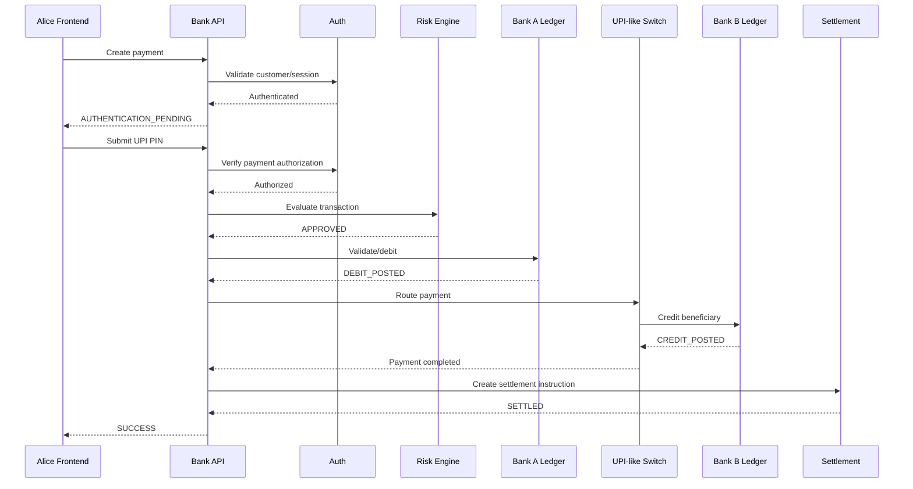

# Indian Banking & Payment-System Simulation — Spring Boot Implementation Specification

## 0. Purpose

Build a **local educational simulation of an Indian inter-bank digital payment system** using Spring Boot, with two frontend users who own separate simulated bank accounts and can transfer money between one another.

The application must model the important **publicly documented concepts** used by Indian payment systems: customer authentication, transaction authorization, account/ledger posting, inter-bank routing, transaction state management, idempotency, asynchronous messaging, failure handling, settlement simulation, reconciliation, audit trails, and fraud/risk checks.

**Important accuracy boundary:** this project is a simulation. Do **not** claim that it reproduces NPCI, RBI, a particular bank's Core Banking System (CBS), private NPCI message formats, cryptographic key material, HSM implementation, proprietary bank software, or production regulatory controls. Those internals are not publicly available as a complete implementation. Instead, reproduce the *architectural behavior and publicly documented concepts* in a transparent educational model.

Public reference points to preserve in the implementation:
- NPCI describes UPI as an instant payment system for inter-bank account transfers, built over IMPS infrastructure. UPI supports identifiers such as UPI ID and account number + IFSC, and its documented security model uses 2-factor authentication with the UPI PIN as the second factor.
- NPCI describes IMPS as a real-time, round-the-clock payment service and publishes member/settlement information.
- RBI documents NEFT as 24x7x365 with half-hourly batches and distinguishes it from real-time fast-payment systems.
- RBI documents RTGS as a real-time gross settlement system operated by RBI.

References:
- https://www.npci.org.in/product/upi
- https://www.npci.org.in/PDF/npci/upi/Product-Booklet.pdf
- https://www.npci.org.in/product/imps
- https://www.npci.org.in/PDF/npci/imps/Product-Booklet.pdf
- https://www.rbi.org.in/scripts/faqview.aspx/upload/FAQView.aspx?Id=144
- https://www.rbi.org.in/Scripts/BS_ViewMasDirections.aspx?id=11750

---

# 1. Target Result

Create a complete runnable system with this logical topology:

```text
                         FRONTEND A
                    User A / Account A
                           |
                           v
                    +-------------+
                    | API Gateway |
                    +-------------+
                           |
                           v
                    +----------------+
                    | Auth Service   |
                    +----------------+
                           |
                           v
                    +----------------+
                    | Payment API    |
                    +----------------+
                           |
          +----------------+----------------+
          |                                 |
          v                                 v
   +--------------+                  +--------------+
   | Risk Engine  |                  | Account/CBS  |
   +--------------+                  +--------------+
                                           |
                                           v
                                    +--------------+
                                    | Ledger       |
                                    +--------------+
                                           |
                                           v
                                    +--------------+
                                    | Outbox       |
                                    +--------------+
                                           |
                                           v
                                    +--------------+
                                    | Message Bus  |
                                    | Kafka        |
                                    +--------------+
                                           |
                                           v
                                    +--------------+
                                    | Payment      |
                                    | Switch       |
                                    +--------------+
                                           |
                                           v
                                    +--------------+
                                    | Settlement   |
                                    | Simulator    |
                                    +--------------+
                                           |
                                           v
                                    +--------------+
                                    | Bank B       |
                                    | Simulation   |
                                    +--------------+
                                           |
                                           v
                                     Account B
                                         |
                                         v
                                   FRONTEND B
```

The first version may use a **modular monolith** with separate Spring packages/modules. The architecture must nevertheless have clear boundaries so services can later be split into microservices.

---

# 2. Technology Requirements

Use:

```text
Java 21+
Spring Boot 3.x+
Spring Web
Spring Data JPA
PostgreSQL
Flyway
Spring Security
JWT
Bean Validation
Spring Kafka
Actuator
JUnit 5
Mockito
Testcontainers
Lombok (optional)
```

Development infrastructure:

```text
Docker
Docker Compose
PostgreSQL
Kafka
Kafka UI
```

Frontend:

```text
React
Vite
TypeScript preferred
```

Do not introduce unnecessary technologies in version 1.

Redis may be added later for idempotency/risk caching, but the first production-quality simulation must work correctly without Redis.

---

# 3. Core Simulation Model

The application represents two simulated banks:

```text
BANK_A
BANK_B
```

Each bank owns accounts.

Example seeded accounts:

```text
Bank A
--------------------------------
Account A
Customer: Alice
Account Number: 1000000001
IFSC: SIMU000001
UPI ID: alice@bankA
Balance: ₹50,000
UPI PIN: 123456 (stored only as a one-way hash)

Bank B
--------------------------------
Account B
Customer: Bob
Account Number: 2000000001
IFSC: SIMU000002
UPI ID: bob@bankB
Balance: ₹10,000
UPI PIN: 654321
```

Do not store raw UPI PINs.

The frontend should never receive:

```text
password
UPI PIN
PIN hash
JWT signing secret
internal risk data
```

---

# 4. Banking Concepts to Simulate

Implement these concepts explicitly:

```text
1. Customer
2. User authentication
3. Account
4. Bank
5. Beneficiary / Payee
6. Payment initiation
7. Authentication factor
8. Authorization
9. Risk evaluation
10. Transaction
11. Ledger
12. Ledger Entry
13. Payment Switch
14. Routing
15. Settlement
16. Reconciliation
17. Audit Event
18. Notification
19. Idempotency
20. Retry
21. Timeout
22. Reversal
23. Transaction status inquiry
24. Fraud flag
```

---

# 5. Explicit Separation of Authentication and Authorization

Never combine these concepts.

## Authentication

Answers:

```text
Who is the customer?
```

Use:

```text
username/email/mobile
password
JWT
device registration
UPI PIN for payment authorization
```

## Authorization

Answers:

```text
Is this authenticated customer allowed to do this operation?
```

Check:

```text
account ownership
account active status
transaction limit
available balance
beneficiary state
payment rail rules
risk decision
transaction state
```

Example:

```text
POST /api/payments

Authentication:
JWT valid -> YES

Authorization:
User owns Account A -> YES

Transaction authorization:
UPI PIN valid -> YES

Risk:
LOW -> YES

Balance:
₹50,000 >= ₹5,000 -> YES

Final:
AUTHORIZED
```

---

# 6. Authentication Design

Implement two levels.

## 6.1 Application Login

Create:

```text
POST /api/auth/register
POST /api/auth/login
POST /api/auth/refresh
POST /api/auth/logout
```

Use Spring Security.

Passwords:

```text
BCrypt / Argon2
```

Never store passwords as plaintext.

JWT claims should contain only required non-sensitive identity/authorization information.

Example conceptual JWT:

```json
{
  "sub": "USER-10001",
  "roles": ["CUSTOMER"],
  "iat": 0,
  "exp": 0
}
```

Do not put balance, PIN, or sensitive account data in the JWT.

---

# 7. Payment Authentication / UPI-PIN Simulation

For educational simulation, implement:

```text
POST /api/payments/{paymentId}/authorize
```

Request:

```json
{
  "upiPin": "123456"
}
```

Rules:

```text
1. Require a valid authenticated session.
2. Load the payer's account.
3. Verify the supplied PIN against its hash.
4. Never log the PIN.
5. Never return the PIN.
6. Rate-limit failed attempts.
7. Lock or reject after configurable repeated failures.
8. Record an AuthenticationEvent without recording the secret.
```

Conceptual status:

```text
AUTHENTICATION_PENDING
        |
        | correct PIN
        v
AUTHENTICATED
```

If incorrect:

```text
AUTHENTICATION_PENDING
        |
        | incorrect PIN
        v
AUTHENTICATION_FAILED
```

The simulation should expose to the frontend only a generic failure message.

---

# 8. Account and Ledger Design

Do not make `Account.balance` the only source of financial truth.

Create an append-oriented ledger model.

## Account

Fields:

```text
id
accountNumber
ifsc
bankId
customerId
currency
status
availableBalance
createdAt
updatedAt
version
```

Use optimistic locking:

```java
@Version
private Long version;
```

or another explicit concurrency strategy.

## LedgerEntry

Fields:

```text
id
transactionId
accountId
entryType
direction
amount
currency
balanceAfter
reference
createdAt
```

Where:

```text
entryType:
DEBIT
CREDIT
HOLD
RELEASE
REVERSAL
FEE
```

The ledger must be append-only from the application perspective.

Do not update old financial entries to rewrite history.

A correction should generate a compensating entry.

Example:

```text
Original:
DEBIT ₹5,000

Reversal:
CREDIT ₹5,000
```

---

# 9. Financial Invariants

Create a service/component dedicated to validating financial invariants.

At minimum:

```text
1. No unauthorized debit.
2. Every successful debit has a corresponding payment result.
3. Every cross-bank successful payment has both sender-side and receiver-side financial postings.
4. Amount must always be positive.
5. Currency must match.
6. Transaction IDs are unique.
7. Duplicate requests must not double debit.
8. Reversal must not create money.
9. Ledger entries cannot be silently deleted.
10. Account balance must reconcile against ledger state.
```

Use `BigDecimal` for all monetary values.

Never use `double` or `float` for money.

---

# 10. Database Transaction Boundary

Any operation that modifies a single bank/account ledger must use a proper database transaction.

Example concept:

```java
@Transactional
public PaymentResult debitAccount(...) {
    // validate current state
    // lock/update account state
    // create ledger entries
    // create outbox event
    // commit
}
```

Do not call an external network synchronously from inside a long-running database transaction.

The preferred architecture is:

```text
DB transaction
    |
    +--> update financial state
    +--> create transaction state
    +--> write outbox event
    |
    COMMIT
       |
       v
Outbox Publisher
       |
       v
Kafka
```

---

# 11. Concurrency

The implementation must explicitly handle:

```text
two simultaneous payments from the same account
```

Example:

```text
Account A = ₹10,000

Request 1 = ₹7,000
Request 2 = ₹7,000
```

Both must not succeed simply because both initially observed ₹10,000.

Implement one clear strategy:

### Preferred first version

Optimistic locking with retry.

or, if the implementation needs serialized account mutation:

Pessimistic row locking.

Document which strategy is used and why.

Write a concurrency integration test proving:

```text
initial = 10000
payment1 = 7000
payment2 = 7000

successful transfers <= 1
```

---

# 12. Payment Domain Model

Create a `PaymentTransaction` entity.

Suggested fields:

```text
id
transactionId
idempotencyKey
senderCustomerId
senderAccountId
senderBankId
receiverCustomerId
receiverAccountId
receiverBankId
receiverUpiId
amount
currency
paymentRail
status
failureCode
failureReason
riskScore
riskDecision
createdAt
authorizedAt
processedAt
completedAt
updatedAt
version
```

Possible `paymentRail`:

```text
SIMULATED_UPI
SIMULATED_IMPS
SIMULATED_NEFT
SIMULATED_RTGS
```

Default the frontend to:

```text
SIMULATED_UPI
```

---

# 13. Payment State Machine

This is mandatory.

Implement statuses:

```text
INITIATED
AUTHENTICATION_PENDING
AUTHENTICATED
RISK_CHECK_PENDING
RISK_APPROVED
RISK_DECLINED
BALANCE_CHECK_PENDING
AUTHORIZED
ROUTING
PROCESSING
BENEFICIARY_ACCEPTED
DEBIT_POSTED
CREDIT_POSTED
SETTLEMENT_PENDING
SETTLED
SUCCESS
FAILED
TIMEOUT
REVERSAL_PENDING
REVERSED
```

Do not allow arbitrary state changes.

Create a state-transition component.

Example:

```text
INITIATED
   |
   v
AUTHENTICATION_PENDING
   |
   | correct PIN
   v
AUTHENTICATED
   |
   v
RISK_CHECK_PENDING
   |
   | approved
   v
RISK_APPROVED
   |
   v
BALANCE_CHECK_PENDING
   |
   v
AUTHORIZED
   |
   v
ROUTING
   |
   v
PROCESSING
   |
   v
BENEFICIARY_ACCEPTED
   |
   v
DEBIT_POSTED
   |
   v
CREDIT_POSTED
   |
   v
SETTLEMENT_PENDING
   |
   v
SETTLED
   |
   v
SUCCESS
```

Failure branches must be explicit.

---

# 14. Idempotency

Implement mandatory idempotency on payment creation.

Client sends:

```http
Idempotency-Key: 8b7e2e9c-...
```

Rules:

```text
Same authenticated payer
+
Same idempotency key
=
same logical payment
```

If the same request is repeated:

```text
Do not create a second payment.
Do not debit twice.
Return the existing transaction state/result.
```

Store enough request/result information to safely handle retries.

Create a unique database constraint on the appropriate idempotency scope.

---

# 15. Payment API

Implement approximately:

```text
POST   /api/auth/register
POST   /api/auth/login
GET    /api/accounts/me
GET    /api/accounts/me/balance
GET    /api/accounts/me/transactions

POST   /api/beneficiaries
GET    /api/beneficiaries

POST   /api/payments
GET    /api/payments/{transactionId}
POST   /api/payments/{transactionId}/authorize
POST   /api/payments/{transactionId}/cancel

GET    /api/payments/{transactionId}/events

GET    /api/reconciliation/transactions/{transactionId}

GET    /api/admin/payments
GET    /api/admin/settlements
GET    /api/admin/reconciliation
```

Use DTOs. Do not expose JPA entities directly.

Validate every request using Bean Validation.

---

# 16. Payment Creation Flow

The first request should NOT immediately execute the entire transfer.

Recommended flow:

```text
POST /api/payments
       |
       v
Validate request
       |
       v
Validate receiver
       |
       v
Create PAYMENT
status = AUTHENTICATION_PENDING
       |
       v
Return transactionId
```

Response:

```json
{
  "transactionId": "TXN-...",
  "status": "AUTHENTICATION_PENDING",
  "amount": 5000,
  "currency": "INR",
  "receiver": "bob@bankB"
}
```

Then:

```text
POST /api/payments/{transactionId}/authorize
```

with PIN.

This separates:

```text
payment initiation
```

from:

```text
transaction authorization
```

---

# 17. Routing

Create a `PaymentRouter`.

Responsibilities:

```text
Determine sender bank.
Determine receiver bank.
Determine payment rail.
Determine destination participant.
Create internal routing event.
```

Example:

```text
SIMULATED_UPI
   |
   v
UPI-like Switch Simulator
   |
   +--> Bank A Adapter
   |
   +--> Bank B Adapter
```

The router must NOT directly modify Bank B's account database.

Instead:

```text
Bank A
  |
  v
Payment Switch
  |
  v
Bank B Adapter
  |
  v
Bank B Ledger
```

This architectural separation is required.

---

# 18. Simulated UPI Switch

Create a dedicated package/module:

```text
paymentnetwork/upi/
```

Classes:

```text
UpiSwitch
UpiRouter
UpiMessage
UpiTransactionProcessor
UpiBankParticipant
UpiResponse
```

The switch receives a sanitized payment message such as:

```json
{
  "messageId": "MSG-...",
  "transactionId": "TXN-...",
  "payerBank": "BANK_A",
  "payeeBank": "BANK_B",
  "payerVpa": "alice@bankA",
  "payeeVpa": "bob@bankB",
  "amount": 5000,
  "currency": "INR"
}
```

Do not place PINs into network messages.

The PIN authentication occurs at the payer-bank security boundary in this simulation.

---

# 19. Bank Adapter Pattern

Create:

```text
interface BankParticipant
```

Example:

```java
public interface BankParticipant {
    BankResponse processCredit(CreditInstruction instruction);
    BankResponse validateBeneficiary(BeneficiaryQuery query);
    BankResponse inquireStatus(StatusQuery query);
}
```

Implement:

```text
BankAParticipant
BankBParticipant
```

Each participant must behave like a separate bank boundary even when both use the same PostgreSQL database in the first version.

The code must make it possible later to move Bank A and Bank B to different services/databases.

---

# 20. Simulated Inter-Bank Boundary

Create a strict boundary:

```text
Payment Switch
       |
       | message
       v
Receiving Bank Adapter
       |
       v
Receiving Bank Processing
       |
       v
Receiving Account Ledger
```

Do not call:

```text
accountService.credit(senderAccount, receiverAccount)
```

from a single monolithic method.

Instead use:

```text
Debit instruction
Payment message
Credit instruction
Settlement instruction
```

This makes the simulation resemble a distributed payment ecosystem.

---

# 21. Outbox Pattern

Implement an `outbox_event` table.

Suggested fields:

```text
id
eventId
aggregateType
aggregateId
eventType
payload
status
attemptCount
availableAt
createdAt
publishedAt
lastError
```

Within the same DB transaction as the financial state change:

```text
payment transaction
+
ledger mutation
+
outbox event
```

must commit together.

A background publisher sends outbox records to Kafka.

Do not rely only on:

```java
paymentRepository.save(...);
kafkaTemplate.send(...);
```

because a database commit and Kafka publish can fail independently.

---

# 22. Kafka Topics

Create topics such as:

```text
payment.initiated
payment.authenticated
payment.risk.checked
payment.routed
payment.bank.credit.requested
payment.bank.credited
payment.debit.posted
payment.settlement.requested
payment.settlement.completed
payment.completed
payment.failed
payment.reversal.requested
payment.reversal.completed
payment.dlq
```

Use an appropriate transaction ID/message ID as the event key.

Consumers must be idempotent.

---

# 23. Event Processing

Example:

```text
payment.authorized
       |
       v
Risk consumer
       |
       v
payment.risk.approved
       |
       v
Routing consumer
       |
       v
payment.routed
       |
       v
Bank B credit consumer
       |
       v
payment.credit.posted
       |
       v
Settlement consumer
       |
       v
payment.settled
```

Every consumer:

```text
1. Validates event.
2. Checks duplicate event handling.
3. Performs required state transition.
4. Writes DB state.
5. Creates next outbox event.
6. Commits transaction.
```

---

# 24. Retry Policy

Implement bounded retry.

Example:

```text
attempt 1
wait
attempt 2
wait
attempt 3
wait
DLQ
```

Use exponential backoff.

Do not retry forever.

Retry only operations that are safe/idempotent.

---

# 25. Timeout Simulation

Add configurable failure injection.

Example configuration:

```yaml
simulation:
  bank-b:
    enabled: true
    response-delay-ms: 500
    timeout-probability: 0.0
    failure-probability: 0.0
```

Allow controlled testing of:

```text
Bank B unavailable
Bank B delayed
Network timeout
Duplicate event
Kafka delayed
Credit failure
Settlement failure
```

This is an educational simulator, so a frontend/admin control may change these values.

---

# 26. Critical Failure Scenario

Test:

```text
Debit posted
Credit response lost
```

The application must NOT blindly debit again during retry.

Use:

```text
transactionId
messageId
idempotencyKey
```

and status inquiry/reconciliation.

Possible flow:

```text
DEBIT_POSTED
     |
     v
CREDIT_REQUESTED
     |
     v
TIMEOUT
     |
     +----> status inquiry ----> CREDITED
     |
     +----> status inquiry ----> UNKNOWN
                              |
                              v
                         RECONCILIATION
```

---

# 27. Reversal

Implement a reversal workflow.

Example:

```text
Debit succeeded
Credit permanently failed
```

Then:

```text
REVERSAL_PENDING
       |
       v
CREDIT reversal to sender
       |
       v
REVERSED
```

Never delete the original debit.

The reversal must create a new ledger entry.

---

# 28. Settlement Simulator

Build a separate `SettlementService`.

For a successful simulated inter-bank payment:

```text
Bank A owes Bank B ₹5,000
```

Represent this as a settlement position:

```text
settlement_position

bankId
currency
netAmount
updatedAt
```

Example:

```text
BANK_A   -5000
BANK_B   +5000
```

For an educational simulation, allow two modes.

### Immediate simulation

```text
Payment success
      |
      v
Settlement immediately posted
```

### Batch simulation

Useful for demonstrating the distinction between instant customer experience and settlement processing:

```text
payment completed
      |
      v
settlement pending
      |
      v
batch processor
      |
      v
settled
```

Do not present this as an exact implementation of any particular current Indian network.

---

# 29. NEFT Simulation

Implement only after the UPI-like rail is stable.

Create:

```text
NEFTSimulator
```

Model:

```text
payment accepted
   |
   v
queued for batch
   |
   v
half-hourly simulation clock
   |
   v
batch created
   |
   v
settlement
   |
   v
beneficiary credit
```

Make batch interval configurable for development:

```yaml
neft:
  batch-interval-seconds: 60
```

Do NOT hardcode 30 minutes during development.

Document that the production RBI NEFT system operates in half-hourly batches and is available 24x7x365.

---

# 30. RTGS Simulation

Create:

```text
RTGSSimulator
```

Model:

```text
payment request
    |
    v
validation
    |
    v
gross settlement
    |
    v
beneficiary posting
```

Represent it as individual settlement rather than batch netting.

Again, this is a conceptual simulator, not a real RBI RTGS implementation.

---

# 31. IMPS Simulation

Create:

```text
IMPSSimulator
```

Model it as an immediate inter-bank rail:

```text
payer bank
    |
    v
IMPS switch
    |
    v
beneficiary bank
    |
    v
beneficiary ledger
```

Keep it structurally similar to the UPI simulator but use a separate rail abstraction.

---

# 32. Risk Engine

Create:

```text
RiskEngine
RiskRule
RiskDecision
```

Initial rules:

```text
R001: amount exceeds configurable threshold
R002: too many payments in short window
R003: new beneficiary
R004: repeated failed PIN attempts
R005: simulated suspicious device
R006: account disabled
```

Return:

```json
{
  "decision": "APPROVE",
  "score": 15,
  "ruleHits": []
}
```

or:

```json
{
  "decision": "REVIEW",
  "score": 92,
  "ruleHits": ["R004", "R005"]
}
```

Do not implement fake “AI fraud detection” unless needed. Deterministic rules are better for this simulation because the behavior is testable.

---

# 33. Beneficiary Management

Implement:

```text
POST /api/beneficiaries
GET /api/beneficiaries
DELETE /api/beneficiaries/{id}
```

Represent:

```text
beneficiaryId
ownerCustomerId
bankId
accountNumber
ifsc
vpa
displayName
status
createdAt
```

Optional initial cooling period:

```text
NEW
ACTIVE
BLOCKED
```

Make cooling period configurable.

---

# 34. Audit Trail

Create immutable `audit_event`.

Fields:

```text
id
eventId
actorUserId
transactionId
eventType
source
timestamp
result
correlationId
metadata
```

Events:

```text
LOGIN_SUCCESS
LOGIN_FAILURE
PAYMENT_CREATED
PIN_AUTH_SUCCESS
PIN_AUTH_FAILURE
RISK_APPROVED
RISK_DECLINED
DEBIT_POSTED
CREDIT_POSTED
SETTLEMENT_POSTED
PAYMENT_SUCCESS
PAYMENT_FAILED
REVERSAL_CREATED
```

Never log:

```text
UPI PIN
password
JWT secret
database password
private keys
```

---

# 35. Correlation ID

Every incoming request should receive or generate:

```text
X-Correlation-Id
```

Pass it across:

```text
REST
Kafka headers
logs
audit events
payment events
```

Also maintain:

```text
transactionId
messageId
eventId
idempotencyKey
```

These identifiers have different purposes and must not be treated as interchangeable.

---

# 36. API Error Model

Use one standard error response:

```json
{
  "timestamp": "2026-09-09T19:30:00Z",
  "status": 409,
  "code": "INSUFFICIENT_FUNDS",
  "message": "The payment could not be authorized.",
  "correlationId": "CORR-...",
  "transactionId": "TXN-..."
}
```

Do not expose internal stack traces.

---

# 37. Frontend Requirements

Build two separate user experiences using the same frontend application.

Allow switching between:

```text
Alice / Account A
Bob / Account B
```

The UI should clearly show:

```text
Current User
Bank
Account
UPI ID
Available Balance
```

Do not show the other user's private authentication data.

---

# 38. User A Payment UI

Flow:

```text
Dashboard
   |
   v
Send Money
   |
   v
Select beneficiary
   |
   v
Enter amount
   |
   v
Review
   |
   v
Enter UPI PIN
   |
   v
Processing
   |
   v
Transaction Timeline
   |
   v
Success / Failed / Pending
```

Display a transaction timeline:

```text
✓ Payment initiated
✓ Customer authenticated
✓ Risk checks passed
✓ Payment routed
✓ Receiving bank accepted
✓ Debit posted
✓ Credit posted
✓ Settlement completed
✓ Payment successful
```

If a failure occurs, show exactly where the simulation failed.

---

# 39. User B Receiving UI

When User A successfully sends money:

```text
User B dashboard
       |
       v
Balance increases
       |
       v
Transaction appears
       |
       v
"Received ₹5,000 from Alice"
```

Use WebSocket/SSE for real-time updates.

Preferred:

```text
Spring WebSocket / SSE
```

The frontend should not repeatedly poll every second.

---

# 40. Transaction Detail Page

Show:

```text
Transaction ID
Payment Rail
Sender Bank
Receiver Bank
Amount
Currency
Created Time
Authorized Time
Processed Time
Completed Time
Current Status
```

Then show the state transition timeline:

```text
INITIATED
AUTHENTICATION_PENDING
AUTHENTICATED
RISK_CHECK_PENDING
RISK_APPROVED
AUTHORIZED
ROUTING
PROCESSING
DEBIT_POSTED
CREDIT_POSTED
SETTLEMENT_PENDING
SETTLED
SUCCESS
```

Also provide:

```text
Event ID
Correlation ID
Message ID
```

for learning/debugging.

Do not expose confidential fields.

---

# 41. Admin / Simulation Dashboard

Create an admin-only page.

Show:

```text
Total payments
Successful
Failed
Pending
Timed out
Reversed
Total value
Settlement positions
Failed messages
DLQ count
```

Add failure-injection controls:

```text
Bank B unavailable
Bank B delay
Network timeout
Duplicate message
Credit failure
Settlement failure
```

This is critical for demonstrating distributed-system failure handling.

---

# 42. Project Package Structure

Use a domain-oriented package structure such as:

```text
src/main/java/com/example/banksim/

├── BankSimulationApplication.java
│
├── common/
│   ├── config/
│   ├── exception/
│   ├── security/
│   ├── audit/
│   ├── idempotency/
│   ├── correlation/
│   └── util/
│
├── auth/
│   ├── controller/
│   ├── service/
│   ├── domain/
│   ├── repository/
│   └── dto/
│
├── customer/
│   ├── controller/
│   ├── service/
│   ├── domain/
│   └── repository/
│
├── bank/
│   ├── domain/
│   ├── repository/
│   └── service/
│
├── account/
│   ├── controller/
│   ├── service/
│   ├── domain/
│   ├── repository/
│   └── dto/
│
├── beneficiary/
│   ├── controller/
│   ├── service/
│   ├── domain/
│   └── repository/
│
├── payment/
│   ├── controller/
│   ├── service/
│   ├── state/
│   ├── domain/
│   ├── repository/
│   ├── dto/
│   └── event/
│
├── ledger/
│   ├── service/
│   ├── domain/
│   └── repository/
│
├── risk/
│   ├── service/
│   ├── rule/
│   └── domain/
│
├── paymentnetwork/
│   ├── common/
│   ├── upi/
│   ├── imps/
│   ├── neft/
│   └── rtgs/
│
├── switch/
│   ├── service/
│   └── domain/
│
├── settlement/
│   ├── service/
│   ├── domain/
│   └── repository/
│
├── reconciliation/
│   ├── service/
│   ├── domain/
│   └── repository/
│
├── outbox/
│   ├── service/
│   ├── publisher/
│   └── repository/
│
├── notification/
│   ├── service/
│   └── websocket/
│
└── simulation/
    ├── controller/
    ├── service/
    └── failure/
```

Keep domain logic out of controllers.

---

# 43. Database Tables

At minimum:

```text
users
roles
user_roles

banks
bank_accounts

customers
customer_accounts

beneficiaries

payment_transactions
payment_state_history

ledger_entries

authentication_events
risk_decisions
risk_rule_hits

outbox_events
processed_events

settlement_positions
settlement_entries

reconciliation_records

audit_events

notifications
```

Add indexes for:

```text
account_number
upi_id
transaction_id
idempotency_key
created_at
payment status
outbox status
settlement status
```

Use unique constraints where logically required.

---

# 44. Flyway

Create migrations:

```text
V1__create_users.sql
V2__create_banks.sql
V3__create_accounts.sql
V4__create_beneficiaries.sql
V5__create_payments.sql
V6__create_ledger.sql
V7__create_risk_tables.sql
V8__create_outbox.sql
V9__create_settlement.sql
V10__create_reconciliation.sql
V11__create_audit.sql
V12__create_notifications.sql
V13__seed_simulation_data.sql
```

Never use Hibernate auto schema creation for the main simulation environment.

Use:

```yaml
spring.jpa.hibernate.ddl-auto: validate
```

---

# 45. Seed Data

On first startup create:

```text
Bank A
Bank B

Alice
Bob

Account A
Account B

Alice's beneficiary -> Bob
Bob's beneficiary -> Alice
```

Suggested balances:

```text
Alice = ₹50,000
Bob   = ₹10,000
```

Seed PINs only through secure one-way hashing.

Document the development credentials separately in README.

---

# 46. Money Transfer Invariants

For:

```text
Alice = 50,000
Bob = 10,000
Transfer = 5,000
```

Before:

```text
Alice = 50,000
Bob   = 10,000
Total = 60,000
```

After:

```text
Alice = 45,000
Bob   = 15,000
Total = 60,000
```

The simulation must preserve:

```text
Total customer money = unchanged
```

unless the simulation explicitly models a fee.

If fee = ₹10:

```text
Alice = 44,990
Bob   = 15,000
Fee account = 10

Total = 60,000
```

Never accidentally create or destroy money.

---

# 47. Reconciliation Engine

Create a scheduled process.

Examples:

```text
@Scheduled(...)
```

Checks:

```text
1. Payment status vs ledger.
2. Sender debit vs receiver credit.
3. Settlement entries vs successful cross-bank payments.
4. Duplicate events.
5. Missing credits.
6. Missing debits.
7. Unresolved TIMEOUT transactions.
8. Reversed transactions.
```

Create reconciliation result:

```text
MATCHED
MISMATCH
MISSING_DEBIT
MISSING_CREDIT
DUPLICATE
UNKNOWN
```

Provide an admin page to inspect mismatches.

---

# 48. Transaction History

For each account show:

```text
Date
Description
Debit
Credit
Balance After
Transaction ID
Status
Rail
```

Example:

```text
09 Sep 2026
To Bob
Debit ₹5,000
Balance ₹45,000
TXN-123
SUCCESS
SIMULATED_UPI
```

Do not calculate history solely from mutable account balance.

Use ledger entries as the primary financial history.

---

# 49. Security Requirements

Implement:

```text
HTTPS-ready configuration
Spring Security
JWT
Password hashing
CORS policy
Method authorization
Input validation
Rate limiting for PIN attempts
Audit logging
Secret configuration through environment variables
```

Do not commit:

```text
JWT secret
DB password
Kafka credentials
private keys
PINs
```

Use environment variables.

---

# 50. Important Security Simulation Boundary

Do NOT attempt to implement actual UPI cryptographic protocol internals from incomplete public descriptions.

The simulator should model:

```text
authenticated customer
+
authorized payment
+
protected internal payment message
+
audit trail
```

but should not pretend to be an actual UPI participant.

Create clear comments like:

```java
/**
 * Educational simulation of an inter-bank payment switch.
 * This is not an implementation of the NPCI UPI protocol.
 */
```

---

# 51. Observability

Use Spring Boot Actuator.

Expose:

```text
health
metrics
info
```

Log structured fields:

```text
timestamp
level
service
correlationId
transactionId
eventId
messageId
status
```

Example:

```text
INFO transactionId=TXN-123 event=PAYMENT_ROUTED bankA=BANK_A bankB=BANK_B
```

Never log authentication secrets.

---

# 52. Metrics

Create metrics such as:

```text
payments_total
payments_success_total
payments_failed_total
payments_timeout_total
payment_processing_duration
fraud_declines_total
ledger_debit_total
ledger_credit_total
settlement_total
reconciliation_mismatch_total
outbox_pending_total
kafka_consumer_lag
```

---

# 53. Testing Requirements

Do not stop after unit tests.

Create:

## Unit tests

Test:

```text
PIN verification
risk rules
state transitions
routing
ledger calculation
idempotency
reversal
```

## Integration tests

Test:

```text
REST -> PostgreSQL
Payment -> Ledger
Outbox -> Kafka
Kafka -> Bank B
Settlement
Reconciliation
```

Use Testcontainers.

## Concurrency test

Run simultaneous payments.

## Failure tests

Test:

```text
Bank B unavailable
Kafka unavailable
duplicate event
network timeout
credit failure
debit failure
settlement failure
```

---

# 54. End-to-End Test Scenario

Automate this complete scenario:

```text
1. Login as Alice.
2. Check balance = ₹50,000.
3. Login as Bob.
4. Check balance = ₹10,000.
5. Alice creates ₹5,000 payment to bob@bankB.
6. Payment enters AUTHENTICATION_PENDING.
7. Alice authorizes with UPI PIN.
8. Risk engine approves.
9. Payment router selects SIMULATED_UPI.
10. Payment switch routes BANK_A -> BANK_B.
11. Bank A posts debit.
12. Bank B posts credit.
13. Settlement is processed.
14. Payment becomes SUCCESS.
15. Alice balance = ₹45,000.
16. Bob balance = ₹15,000.
17. Both transaction histories show the payment.
18. Reconciliation reports MATCHED.
```

---

# 55. Idempotency Test Scenario

Send the exact same:

```text
Idempotency-Key
```

three times.

Expected:

```text
1 logical payment
1 debit
1 credit
1 settlement
```

not:

```text
3 debits
3 credits
```

---

# 56. Lost Response Test

Simulate:

```text
Bank B successfully credits
response is lost
```

Then retry.

Expected:

```text
No second credit.
Original transaction eventually becomes SUCCESS.
```

This is a mandatory test.

---

# 57. Insufficient Funds Test

Alice has:

```text
₹5,000
```

Attempt:

```text
₹7,000
```

Expected:

```text
AUTHENTICATED
      ↓
RISK_APPROVED
      ↓
BALANCE_CHECK
      ↓
FAILED
```

No ledger debit.

---

# 58. Concurrent Debit Test

Alice has:

```text
₹10,000
```

Two concurrent payments:

```text
₹7,000
₹7,000
```

Expected:

```text
one SUCCESS
one INSUFFICIENT_FUNDS / CONFLICT
```

Never allow both.

---

# 59. Reversal Test

Simulate:

```text
Debit successful
Bank B credit permanently fails
```

Expected:

```text
DEBIT_POSTED
      ↓
CREDIT_FAILED
      ↓
REVERSAL_PENDING
      ↓
REVERSAL CREDIT
      ↓
REVERSED
```

Final balances must return to the correct state.

---

# 60. API Documentation

Use Springdoc/OpenAPI.

Swagger should document:

```text
auth
accounts
beneficiaries
payments
transactions
settlements
reconciliation
simulation
```

For every endpoint document:

```text
request
response
error codes
authentication requirement
idempotency requirement
```

---

# 61. Docker Compose

Create:

```text
docker-compose.yml
```

Services:

```text
postgres
kafka
zookeeper (only if needed by chosen Kafka setup)
kafka-ui
backend
frontend
```

Prefer a current Kafka setup that does not unnecessarily require ZooKeeper when supported by the selected image/configuration.

---

# 62. Configuration Profiles

Create:

```text
application.yml
application-dev.yml
application-test.yml
application-docker.yml
```

Use environment variables:

```text
DB_URL
DB_USERNAME
DB_PASSWORD

JWT_SECRET

KAFKA_BOOTSTRAP_SERVERS
```

---

# 63. Development Stages

Do not attempt the whole system in one huge coding step.

Implement in this exact order.

## Phase 1 — Foundation

Build:

```text
Spring Boot
PostgreSQL
Flyway
Security
Users
Banks
Accounts
```

Verify:

```text
login
account lookup
balance
```

## Phase 2 — Ledger

Build:

```text
LedgerEntry
balance service
transactional account updates
concurrency controls
```

Verify:

```text
manual debit/credit
ledger history
balance invariant
```

## Phase 3 — Payment

Build:

```text
PaymentTransaction
state machine
payment API
idempotency
PIN authorization
```

Verify:

```text
create payment
authorize payment
reject payment
```

## Phase 4 — Risk

Build:

```text
RiskEngine
rules
risk decision
```

## Phase 5 — UPI-like Switch

Build:

```text
PaymentRouter
UpiSwitch
BankParticipant
BankAParticipant
BankBParticipant
```

Verify:

```text
A -> B
```

without Kafka first.

## Phase 6 — Kafka + Outbox

Introduce:

```text
Outbox
Kafka
events
consumers
retry
DLQ
```

Verify the same A -> B transfer still works.

## Phase 7 — Settlement

Build:

```text
SettlementService
settlement positions
settlement entries
```

## Phase 8 — Reconciliation

Build:

```text
ReconciliationService
scheduled checks
admin API
```

## Phase 9 — Failure Simulation

Build:

```text
timeouts
network failure
bank failure
duplicate messages
credit failure
```

## Phase 10 — Frontend

Build:

```text
Alice dashboard
Bob dashboard
send money
UPI PIN screen
transaction status
timeline
admin simulation
```

## Phase 11 — Additional Rails

Add:

```text
IMPS simulator
NEFT simulator
RTGS simulator
```

only after UPI-like flow is stable.

---

# 64. Definition of Done

The project is complete only when this works:

```text
Alice logs in
       ↓
Sees ₹50,000
       ↓
Selects Bob
       ↓
Enters ₹5,000
       ↓
Reviews
       ↓
Enters UPI PIN
       ↓
Authentication succeeds
       ↓
Risk check succeeds
       ↓
Balance check succeeds
       ↓
Payment routed
       ↓
Bank A debit
       ↓
Payment network
       ↓
Bank B credit
       ↓
Settlement
       ↓
Alice sees SUCCESS
       ↓
Alice = ₹45,000
Bob = ₹15,000
       ↓
Both histories updated
       ↓
Reconciliation = MATCHED
```

And the project must also correctly handle:

```text
duplicate request
duplicate Kafka event
insufficient balance
wrong PIN
concurrent transfers
bank timeout
bank unavailable
credit failure
settlement failure
reversal
reconciliation mismatch
```

---

# 65. AI Coding-Agent Instructions

When implementing this specification, follow these rules.

### Rule 1

Do not generate the entire codebase in one uncontrolled response.

Implement one phase at a time.

### Rule 2

Before creating a class, identify:

```text
responsibility
dependencies
transaction boundary
failure modes
security requirements
```

### Rule 3

Never put business logic into controllers.

Controllers should:

```text
validate request
call application service
return DTO
```

### Rule 4

Never expose JPA entities directly through REST.

Use:

```text
Request DTO
Response DTO
Mapper
```

### Rule 5

Money must use:

```java
BigDecimal
```

### Rule 6

All important database mutations must have explicit transaction boundaries.

### Rule 7

All asynchronous consumers must be idempotent.

### Rule 8

Every important payment transition must be auditable.

### Rule 9

Never log secrets.

### Rule 10

Do not silently simplify failure handling.

Whenever a distributed operation can fail between two steps, explicitly model the failure.

### Rule 11

Never use fake comments such as:

```text
// this is exactly how NPCI works
```

Use:

```text
// educational simulation of a corresponding payment-network concept
```

### Rule 12

Do not invent private NPCI protocol details.

Use public high-level behavior and clearly label simulation-specific implementation.

---

# 66. Required Documentation Files

Create:

```text
README.md
ARCHITECTURE.md
TRANSACTION_FLOW.md
DATABASE.md
SECURITY.md
FAILURE_HANDLING.md
API.md
RECONCILIATION.md
SIMULATION.md
```

`TRANSACTION_FLOW.md` must include sequence diagrams.

Use Mermaid.

Example:



Add a second diagram for failure/timeout + reconciliation.

---

# 67. README Must Clearly State

Use wording equivalent to:

```text
This repository is an educational simulation of concepts used in
Indian digital banking and payment systems.

It is NOT connected to NPCI, RBI, UPI, IMPS, NEFT, RTGS, or any
real bank and does not implement their private production protocols.

The project models publicly documented architectural concepts:
authentication, authorization, ledgers, inter-bank routing,
settlement, reconciliation, idempotency, retries, and failure handling.
```

---

# 68. Final Architecture Goal

The final project should teach and demonstrate this complete chain:

```text
                     USER
                      |
                      v
                 FRONTEND
                      |
                      v
               AUTHENTICATION
                      |
                      v
               AUTHORIZATION
                      |
                      v
                 RISK ENGINE
                      |
                      v
              PAYMENT SERVICE
                      |
                      v
              ACCOUNT / CBS
                      |
                      v
                  LEDGER
                      |
                      v
                 OUTBOX
                      |
                      v
                  KAFKA
                      |
                      v
               PAYMENT SWITCH
                      |
           +----------+----------+
           |                     |
           v                     v
       BANK A                 BANK B
           |                     |
           v                     v
       LEDGER                  LEDGER
                                 |
                                 v
                              CREDIT
                                 |
                                 v
                            SETTLEMENT
                                 |
                                 v
                          RECONCILIATION
                                 |
                                 v
                              AUDIT
                                 |
                                 v
                              USER
```

The primary goal is not merely to make “₹5,000 disappear from A and appear in B”.

The goal is to demonstrate **how a payment becomes a controlled, authenticated, authorized, auditable, idempotent, stateful, distributed financial transaction with recoverable failure modes**.
