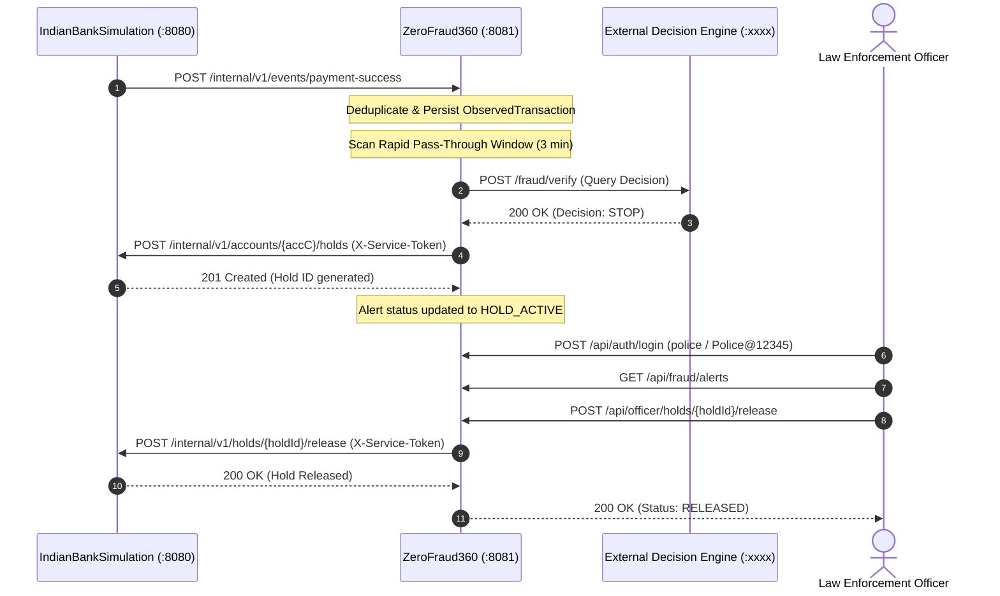

# ZeroFraud360 — API Endpoints Reference

> **Real-Time Fraud Detection & Officer Management REST API Specification**  
> **Service Port**: `8081`  
> **Base URL**: `http://localhost:8081`  
> **Database**: `zerofraud360_db` (MySQL)  
> **Framework**: Spring Boot 3 + Spring Security + JPA / Hibernate

---

## Table of Contents

1. [Service Architecture](#1-service-architecture)
2. [Configuration & Environment Variables](#2-configuration--environment-variables)
3. [Pre-Seeded Officer Credentials & Roles](#3-pre-seeded-officer-credentials--roles)
4. [Request Headers & Security Boundaries](#4-request-headers--security-boundaries)
5. [Standard Error Envelope (`ApiErrorResponse`)](#5-standard-error-envelope-apierrorresponse)
6. [API Endpoints Reference](#6-api-endpoints-reference)
   - [Officer Authentication APIs (`/api/auth/**`)](#61-officer-authentication-apis)
   - [Event Ingestion API (`/internal/v1/events/**`)](#62-event-ingestion-api)
   - [Fraud Query & Monitoring APIs (`/api/fraud/**`)](#63-fraud-query--monitoring-apis)
   - [Officer Review & Hold Release API (`/api/officer/**`)](#64-officer-review--hold-release-api)
7. [External Decision Engine Integration (`POST /fraud/verify`)](#7-external-decision-engine-integration-post-fraudverify)
8. [Bank Simulation Hold Client Integration](#8-bank-simulation-hold-client-integration)
9. [cURL Testing & Verification Guide](#9-curl-testing--verification-guide)

---

## 1. Service Architecture

`ZeroFraud360` operates as an autonomous, high-throughput fraud prevention and case-management engine:
1. **Event Ingestion**: Ingests confirmed payment events (`PAYMENT_SUCCESS`) emitted from core banking systems.
2. **Anomaly Engine**: Executes the `RapidPassThroughRule` to detect laundering and rapid mule pass-throughs:
   $$\text{Leg 1: } A \xrightarrow{\text{₹}X} B \quad \longrightarrow \quad \text{Leg 2: } B \xrightarrow{\text{₹}X} C \quad (\Delta t \le 180\text{ seconds})$$
3. **Decision Verification**: Calls an external decision service (`POST /fraud/verify`) to get a machine-learning / rule verdict (`STOP` vs `ALLOW`).
4. **Automated Fund Freeze**: If the verdict is `STOP`, dispatches an administrative hold instruction to `IndianBankSimulation` to freeze funds on Account C.
5. **Officer Portal**: Provides authenticated officer review tools (`ROLE_POLICE`, `ROLE_CYBER`, `ROLE_BANK`) to audit cases and release holds.



---

## 2. Configuration & Environment Variables

Configuration located in `src/main/resources/application.yml`:

| Property / Env Variable | Default Value | Description |
| :--- | :--- | :--- |
| `server.port` | `8081` | HTTP listening port |
| `DB_URL` | `jdbc:mysql://localhost:3306/zerofraud360_db` | MySQL connection string |
| `DB_USERNAME` | `root` | MySQL username |
| `DB_PASSWORD` | `root` | MySQL password |
| `ZEROFRAUD_JWT_SECRET` | 256-bit Hex Key | HMAC-SHA256 secret for officer JWT tokens |
| `ZEROFRAUD_JWT_EXPIRATION_SECONDS` | `3600` (1 hour) | Officer JWT validity duration |
| `BANK_SIMULATION_BASE_URL` | `http://localhost:8080` | Base URL of bank simulation service |
| `BANK_SIMULATION_SERVICE_TOKEN` | `sim-secret-token-360` | Shared secret token sent in `X-Service-Token` header |
| `FRAUD_DECISION_API_URL` | `http://localhost:xxxx` | Base URL of external ML / rule decision API |
| `fraud.decision-api.verify-path` | `/fraud/verify` | Decision verification endpoint path |
| `fraud.rules.rapid-pass-through.max-time-window-seconds` | `180` (3 minutes) | Sliding time window for pass-through detection |

---

## 3. Pre-Seeded Officer Credentials & Roles

The system does not permit open public self-registration. Only authorized operational roles are pre-seeded:

| Username | Password | Role | Description |
| :--- | :--- | :--- | :--- |
| `police` | `Police@12345` | `ROLE_POLICE` | Law Enforcement Officer — Monitor alerts, unlock cleared holds |
| `cyber` | `Cyber@12345` | `ROLE_CYBER` | Cyber Crime Cell Analyst — Analyze flow logs, release holds |
| `bank` | `Bank@12345` | `ROLE_BANK` | Bank Fraud & Compliance Officer — Inspect alerts, release holds |

> [!NOTE]
> All passwords are encrypted with BCrypt. Accounts automatically lock for 300 seconds (5 minutes) after 5 consecutive failed login attempts.

---

## 4. Request Headers & Security Boundaries

| Header | Description | Required On | Example |
| :--- | :--- | :--- | :--- |
| `Content-Type` | Payload format | All POST/PUT requests | `application/json` |
| `Authorization` | Bearer JWT token | Protected officer APIs (`/api/fraud/**`, `/api/officer/**`, `/api/auth/me`) | `Bearer eyJhbGciOi...` |
| `X-Correlation-Id` | Distributed request tracing ID | Optional (generated automatically if omitted) | `CORR-a4f10d6e-...` |

---

## 5. Standard Error Envelope (`ApiErrorResponse`)

All error responses (4xx and 5xx) follow this standardized JSON schema:

```json
{
  "timestamp": "2026-09-10T06:15:30.123Z",
  "status": 403,
  "code": "ACCESS_DENIED",
  "message": "You do not have permission to access this resource.",
  "correlationId": "CORR-8b7e2e9c-34d2-45af-bc74-6380629a4358",
  "fieldErrors": null
}
```

### Common Error Codes

| Error Code | HTTP Status | Description |
| :--- | :--- | :--- |
| `INVALID_CREDENTIALS` | `401 Unauthorized` | Invalid username or password |
| `UNAUTHORIZED` | `401 Unauthorized` | Missing or expired JWT bearer token |
| `ACCESS_DENIED` | `403 Forbidden` | Insufficient officer role / permission |
| `RESOURCE_NOT_FOUND` | `404 Not Found` | Requested alert ID or hold not found |
| `VALIDATION_FAILED` | `400 Bad Request` | Request payload failed schema validation |
| `INTERNAL_SERVER_ERROR`| `500 Internal Server Error` | Unexpected backend runtime error |

---

## 6. API Endpoints Reference

### 6.1 Officer Authentication APIs

---

#### `POST /api/auth/login`
- **Description**: Authenticates an authorized officer and returns an HMAC-SHA256 signed JWT token valid for 1 hour.
- **Access**: Public
- **Headers**:
  ```http
  Content-Type: application/json
  ```
- **Request Body**:
  ```json
  {
    "username": "police",
    "password": "Police@12345"
  }
  ```
- **Validation Rules**:
  - `username`: Not blank
  - `password`: Not blank
- **Response `200 OK`**:
  ```json
  {
    "accessToken": "eyJhbGciOiJIUzI1NiJ9.eyJzdWIiOiJwb2xpY2UiLC...",
    "tokenType": "Bearer",
    "expiresIn": 3600,
    "username": "police",
    "role": "ROLE_POLICE"
  }
  ```
- **Errors**:
  - `401 Unauthorized` (`INVALID_CREDENTIALS`): Bad username or password.
  - `400 Bad Request` (`VALIDATION_FAILED`): Missing fields.
- **cURL Example**:
  ```bash
  curl -X POST http://localhost:8081/api/auth/login \
    -H "Content-Type: application/json" \
    -d '{"username":"police","password":"Police@12345"}'
  ```

---

#### `GET /api/auth/me`
- **Description**: Returns profile, role, and active status for the currently authenticated officer.
- **Access**: Protected (`ROLE_POLICE`, `ROLE_CYBER`, or `ROLE_BANK`)
- **Headers**:
  ```http
  Authorization: Bearer <OFFICER_JWT_TOKEN>
  ```
- **Response `200 OK`**:
  ```json
  {
    "username": "police",
    "role": "ROLE_POLICE",
    "enabled": true
  }
  ```
- **cURL Example**:
  ```bash
  curl -X GET http://localhost:8081/api/auth/me \
    -H "Authorization: Bearer <OFFICER_JWT_TOKEN>"
  ```

---

#### `POST /api/auth/logout`
- **Description**: Informs the officer client to discard the JWT token.
- **Access**: Protected (`ROLE_POLICE`, `ROLE_CYBER`, or `ROLE_BANK`)
- **Headers**:
  ```http
  Authorization: Bearer <OFFICER_JWT_TOKEN>
  ```
- **Response `200 OK`**:
  ```json
  {
    "message": "Logout successful. Discard token client-side."
  }
  ```

---

### 6.2 Event Ingestion API

---

#### `POST /internal/v1/events/payment-success`
- **Description**: Consumes real-time payment success events emitted by `IndianBankSimulation`.
  - Performs idempotent deduplication on `eventId`.
  - Persists transaction to `observed_transactions`.
  - Scans recent transactions for the rapid pass-through pattern:
    - Finds prior incoming transfer to intermediate account within 180 seconds.
    - Matching currency and equal transfer amount.
  - If pattern matches: generates `FraudAlert`, contacts External Decision API (`POST /fraud/verify`), and if decision is `STOP`, places an immediate fund hold on the recipient account via `IndianBankSimulation`.
- **Access**: Public / Internal network
- **Headers**:
  ```http
  Content-Type: application/json
  ```
- **Request Body**:
  ```json
  {
    "eventId": "EVT-C3D4E5F6A1",
    "eventType": "PAYMENT_SUCCESS",
    "transactionId": "TXN-B7E2E9C34D",
    "occurredAt": "2026-09-10T06:30:00Z",
    "sender": {
      "accountId": "ACC-1000000001",
      "accountNumber": "1000000001",
      "bankId": "BANK_A"
    },
    "receiver": {
      "accountId": "ACC-2000000001",
      "accountNumber": "2000000001",
      "bankId": "BANK_B"
    },
    "amount": 10000.00,
    "currency": "INR",
    "paymentRail": "SIMULATED_UPI",
    "correlationId": "CORR-8b7e2e9c...",
    "messageId": "MSG-00123"
  }
  ```
- **Fields Reference**:
  - `eventId` (Required): Unique event ID used for idempotency.
  - `eventType` (Required): String identifier (e.g. `PAYMENT_SUCCESS`).
  - `transactionId` (Required): Core banking payment transaction reference.
  - `occurredAt` (Required): ISO-8601 timestamp.
  - `sender`: Object with `accountId`, `accountNumber`, `bankId`.
  - `receiver`: Object with `accountId`, `accountNumber`, `bankId`.
  - `amount`: Transaction decimal amount.
  - `currency`: Currency code (e.g. `INR`).
  - `paymentRail`: Payment rail code (e.g. `SIMULATED_UPI`).
- **Response `200 OK`**:
  ```json
  {
    "eventId": "EVT-C3D4E5F6A1",
    "status": "PROCESSED"
  }
  ```
- **cURL Example**:
  ```bash
  curl -X POST http://localhost:8081/internal/v1/events/payment-success \
    -H "Content-Type: application/json" \
    -d '{
      "eventId": "EVT-001",
      "eventType": "PAYMENT_SUCCESS",
      "transactionId": "TXN-1001",
      "occurredAt": "2026-09-10T06:30:00Z",
      "sender": {"accountId":"ACC-1000000001","accountNumber":"1000000001","bankId":"BANK_A"},
      "receiver": {"accountId":"ACC-2000000001","accountNumber":"2000000001","bankId":"BANK_B"},
      "amount": 10000.00,
      "currency": "INR",
      "paymentRail": "SIMULATED_UPI"
    }'
  ```

---

### 6.3 Fraud Query & Monitoring APIs

---

#### `GET /api/fraud/alerts`
- **Description**: Retrieves all detected fraud alerts ordered by newest first.
- **Access**: Protected (`ROLE_POLICE`, `ROLE_CYBER`, or `ROLE_BANK`)
- **Headers**:
  ```http
  Authorization: Bearer <OFFICER_JWT_TOKEN>
  ```
- **Response `200 OK`**:
  ```json
  [
    {
      "id": 1,
      "alertId": "ALERT-D683707CA9",
      "dedupKey": "RAPID_PASS_THROUGH:TXN-1001:TXN-1002",
      "patternType": "RAPID_PASS_THROUGH",
      "status": "HOLD_ACTIVE",
      "firstTransactionId": "TXN-1001",
      "secondTransactionId": "TXN-1002",
      "sourceAccountId": "1000000001",
      "intermediateAccountId": "2000000001",
      "destinationAccountId": "3000000001",
      "firstAmount": 10000.0000,
      "secondAmount": 10000.0000,
      "timeDifferenceSeconds": 45,
      "decision": "STOP",
      "decisionReason": "Rapid pass-through detected: STOP transaction",
      "externalDecisionRequestId": "DEC-ALERT-D683707CA9",
      "holdRequestId": "HOLD-ALERT-D683707CA9",
      "createdAt": "2026-09-10T06:31:00Z",
      "updatedAt": "2026-09-10T06:31:01Z",
      "resolvedAt": null
    }
  ]
  ```
- **Alert Status Enum**:
  - `CREATED`: Alert detected, awaiting decision.
  - `DECISION_REQUESTED`: External decision query dispatched.
  - `HOLD_REQUESTED`: Hold creation sent to core banking.
  - `HOLD_ACTIVE`: Hold successfully placed on recipient account.
  - `RESOLVED`: Hold released by officer or resolved.
  - `DISMISSED`: External decision returned `ALLOW`.
- **cURL Example**:
  ```bash
  curl -X GET http://localhost:8081/api/fraud/alerts \
    -H "Authorization: Bearer <OFFICER_JWT_TOKEN>"
  ```

---

#### `GET /api/fraud/alerts/{alertId}`
- **Description**: Fetches comprehensive metadata for a specific fraud alert.
- **Access**: Protected (`ROLE_POLICE`, `ROLE_CYBER`, or `ROLE_BANK`)
- **Path Variable**: `alertId` — Unique alert ID (e.g. `ALERT-D683707CA9`)
- **Headers**:
  ```http
  Authorization: Bearer <OFFICER_JWT_TOKEN>
  ```
- **Response `200 OK`**: Single `FraudAlert` entity object.
- **Errors**: `404 Not Found` (`RESOURCE_NOT_FOUND`) if alert ID does not exist.
- **cURL Example**:
  ```bash
  curl -X GET http://localhost:8081/api/fraud/alerts/ALERT-D683707CA9 \
    -H "Authorization: Bearer <OFFICER_JWT_TOKEN>"
  ```

---

#### `GET /api/fraud/transactions`
- **Description**: Returns all observed transactions ingested from the banking network.
- **Access**: Protected (`ROLE_POLICE`, `ROLE_CYBER`, or `ROLE_BANK`)
- **Headers**:
  ```http
  Authorization: Bearer <OFFICER_JWT_TOKEN>
  ```
- **Response `200 OK`**:
  ```json
  [
    {
      "id": 1,
      "eventId": "EVT-001",
      "transactionId": "TXN-1001",
      "senderAccountId": "1000000001",
      "receiverAccountId": "2000000001",
      "senderBankId": "BANK_A",
      "receiverBankId": "BANK_B",
      "amount": 10000.0000,
      "currency": "INR",
      "paymentRail": "SIMULATED_UPI",
      "status": "SUCCESS",
      "correlationId": "CORR-12345",
      "messageId": "MSG-998877",
      "occurredAt": "2026-09-10T06:30:00Z",
      "receivedAt": "2026-09-10T06:30:01Z",
      "createdAt": "2026-09-10T06:30:01Z"
    }
  ]
  ```
- **cURL Example**:
  ```bash
  curl -X GET http://localhost:8081/api/fraud/transactions \
    -H "Authorization: Bearer <OFFICER_JWT_TOKEN>"
  ```

---

### 6.4 Officer Review & Hold Release API

---

#### `POST /api/officer/holds/{holdId}/release`
- **Description**: Allows an authorized officer (`police`, `cyber`, or `bank`) to release a hold.
  - Logs an audit entry with officer username, role, and correlation ID.
  - Calls `IndianBankSimulation` at `POST /internal/v1/holds/{holdId}/release` using the trusted service token.
  - Updates associated alert to status `RESOLVED`.
- **Access**: Protected (Role required: `ROLE_POLICE`, `ROLE_CYBER`, or `ROLE_BANK`)
- **Path Variable**: `holdId` — Hold identifier (e.g. `HOLD-ALERT-D683707CA9`)
- **Headers**:
  ```http
  Content-Type: application/json
  Authorization: Bearer <OFFICER_JWT_TOKEN>
  ```
- **Request Body** *(Optional)*:
  ```json
  {
    "officerId": "police",
    "reason": "Legitimate business transaction confirmed with customer."
  }
  ```
- **Response `200 OK`**:
  ```json
  {
    "holdId": "HOLD-ALERT-D683707CA9",
    "status": "RELEASED",
    "officerId": "police",
    "reason": "Legitimate business transaction confirmed with customer."
  }
  ```
- **cURL Example**:
  ```bash
  curl -X POST http://localhost:8081/api/officer/holds/HOLD-ALERT-D683707CA9/release \
    -H "Content-Type: application/json" \
    -H "Authorization: Bearer <OFFICER_JWT_TOKEN>" \
    -d '{
      "reason": "Cleared by Cyber Crime cell after beneficiary verification"
    }'
  ```

---

## 7. External Decision Engine Integration (`POST /fraud/verify`)

When a rapid pass-through anomaly is identified, ZeroFraud360 dispatches an outbound HTTP request to the external decision service:

- **Target URL**: `${FRAUD_DECISION_API_URL:http://localhost:xxxx}/fraud/verify`
- **HTTP Method**: `POST`
- **Headers**: `Content-Type: application/json`

### Outbound Request Payload Sent by ZeroFraud360:
```json
{
  "requestId": "DEC-ALERT-D683707CA9",
  "alertId": "ALERT-D683707CA9",
  "patternType": "RAPID_PASS_THROUGH",
  "firstTransaction": {
    "transactionId": "TXN-1001",
    "senderAccountId": "1000000001",
    "receiverAccountId": "2000000001",
    "amount": 10000.00,
    "currency": "INR",
    "occurredAt": "2026-09-10T06:30:00Z"
  },
  "secondTransaction": {
    "transactionId": "TXN-1002",
    "senderAccountId": "2000000001",
    "receiverAccountId": "3000000001",
    "amount": 10000.00,
    "currency": "INR",
    "occurredAt": "2026-09-10T06:30:45Z"
  },
  "timeDifferenceSeconds": 45,
  "message": "Account 1000000001 sent ₹10000 to Account 2000000001 and Account 2000000001 sent ₹10000 to Account 3000000001 within 1 minute of the first transaction. Is this fraud and should this transaction be stopped?"
}
```

### Supported Response Formats:

1. **JSON Response**:
   ```json
   {
     "requestId": "DEC-ALERT-D683707CA9",
     "decision": "STOP",
     "reason": "Rapid pass-through money mule pattern identified"
   }
   ```
2. **Raw Text Response**:
   ```text
   STOP
   ```
   *(or `ALLOW`)*

---

## 8. Bank Simulation Hold Client Integration

ZeroFraud360 automatically calls `IndianBankSimulation` machine-to-machine APIs to manage fund holds:

1. **Create Hold**:
   - `POST http://localhost:8080/internal/v1/accounts/{destinationAccountId}/holds`
   - Header: `X-Service-Token: sim-secret-token-360`
2. **Release Hold**:
   - `POST http://localhost:8080/internal/v1/holds/{holdId}/release`
   - Header: `X-Service-Token: sim-secret-token-360`

---

## 9. cURL Testing & Verification Guide

### Step 1: Login as Police Officer
```bash
TOKEN=$(curl -s -X POST http://localhost:8081/api/auth/login \
  -H "Content-Type: application/json" \
  -d '{"username":"police","password":"Police@12345"}' | jq -r '.accessToken')
echo "Police Token: $TOKEN"
```

### Step 2: Fetch Current Profile
```bash
curl -s -X GET http://localhost:8081/api/auth/me \
  -H "Authorization: Bearer $TOKEN" | jq .
```

### Step 3: Simulate First Leg Payment Event ($A \rightarrow B$)
```bash
curl -s -X POST http://localhost:8081/internal/v1/events/payment-success \
  -H "Content-Type: application/json" \
  -d '{
    "eventId": "EVT-TEST-001",
    "eventType": "PAYMENT_SUCCESS",
    "transactionId": "TXN-TEST-001",
    "occurredAt": "2026-09-10T06:30:00Z",
    "sender": {"accountId":"ACC-1","accountNumber":"1000000001","bankId":"BANK_A"},
    "receiver": {"accountId":"ACC-2","accountNumber":"2000000001","bankId":"BANK_B"},
    "amount": 10000.00,
    "currency": "INR",
    "paymentRail": "SIMULATED_UPI"
  }' | jq .
```

### Step 4: Simulate Second Leg Payment Event ($B \rightarrow C$ within 3 mins)
```bash
curl -s -X POST http://localhost:8081/internal/v1/events/payment-success \
  -H "Content-Type: application/json" \
  -d '{
    "eventId": "EVT-TEST-002",
    "eventType": "PAYMENT_SUCCESS",
    "transactionId": "TXN-TEST-002",
    "occurredAt": "2026-09-10T06:31:00Z",
    "sender": {"accountId":"ACC-2","accountNumber":"2000000001","bankId":"BANK_B"},
    "receiver": {"accountId":"ACC-3","accountNumber":"3000000001","bankId":"BANK_C"},
    "amount": 10000.00,
    "currency": "INR",
    "paymentRail": "SIMULATED_UPI"
  }' | jq .
```

### Step 5: Query Generated Fraud Alerts
```bash
curl -s -X GET http://localhost:8081/api/fraud/alerts \
  -H "Authorization: Bearer $TOKEN" | jq .
```

### Step 6: Release Hold as Officer
```bash
HOLD_ID="HOLD-ALERT-D683707CA9"

curl -s -X POST "http://localhost:8081/api/officer/holds/$HOLD_ID/release" \
  -H "Content-Type: application/json" \
  -H "Authorization: Bearer $TOKEN" \
  -d '{"reason": "Cleared by police officer after verification"}' | jq .
```
