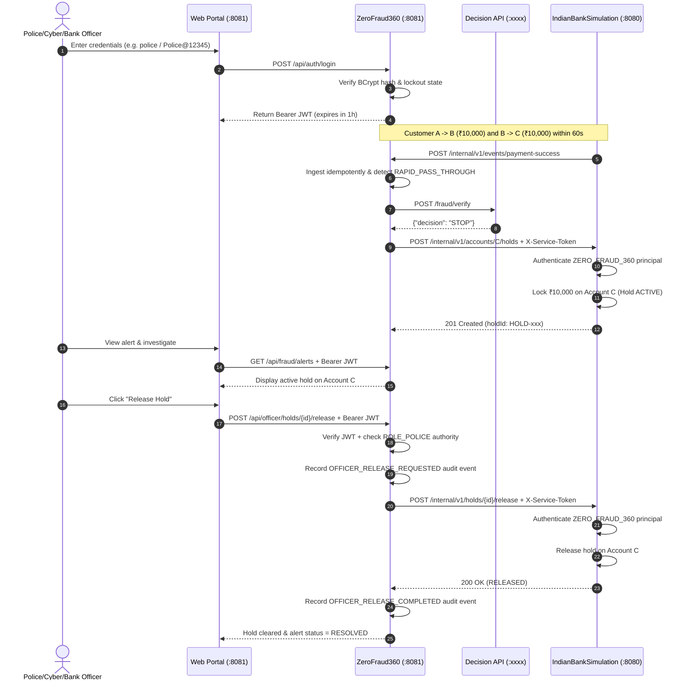

# ZeroFraud360 & IndianBankSimulation — Security Architecture & Threat Model

This document specifies the authentication, authorization, and trust boundaries implemented across the `ZeroFraud360` fraud detection system and `IndianBankSimulation`.

> [!NOTE]
> This system is an educational simulation. It must not be described or deployed as a production implementation of NPCI, RBI, UPI, or a real commercial bank's private security infrastructure.

---

## 1. Trust Boundaries & Principles

There is a fundamental separation between **Human Authentication** and **Service Authentication**:

```text
                     HUMAN AUTHENTICATION CONTEXT
Police / Cyber / Bank Officers
      │
      │ 1. POST /api/auth/login (username + password)
      ▼
 ZeroFraud360 (:8081)
      │
      │ 2. Issue Stateless HMAC-SHA256 Bearer JWT
      ▼
 Protected ZeroFraud360 APIs (/api/fraud/**, /api/officer/**)


                   SERVICE AUTHENTICATION CONTEXT
 ZeroFraud360 Backend (:8081)
      │
      │ 3. Header: X-Service-Token (${BANK_SIMULATION_SERVICE_TOKEN})
      ▼
 IndianBankSimulation Internal Financial-Control APIs (:8080)
      │  (/internal/v1/accounts/{accountId}/holds, /internal/v1/holds/{holdId}/release)
      ▼
 Financial Lock Enforced / Released (ZERO_FRAUD_360 Trusted Service Principal)
```

### Critical Security Rule:
**Human JWTs are NEVER forwarded to IndianBankSimulation.**
ZeroFraud360 authenticates to IndianBankSimulation strictly using the pre-shared internal service credential (`X-Service-Token`). Frontend browsers never have access to this token and cannot manipulate financial holds directly.

---

## 2. Predefined Users & RBAC Matrix

Public user registration in `ZeroFraud360` is permanently disabled. Exactly three pre-seeded administrative accounts exist:

| Username | Role | Default Local Password | Primary Responsibilities |
|---|---|---|---|
| `police` | `ROLE_POLICE` | `Police@12345` | Law enforcement officer: inspect alerts, view money chains, release holds after investigation |
| `cyber` | `ROLE_CYBER` | `Cyber@12345` | Cyber crime analyst: monitor rapid pass-through heuristics, audit transaction hops |
| `bank` | `ROLE_BANK` | `Bank@12345` | Bank compliance officer: audit holds, review AML patterns, collaborate on clearance |

> [!CAUTION]
> Default passwords (`Police@12345`, `Cyber@12345`, `Bank@12345`) are for **local simulation and evaluation only**. In any multi-user or staging environment, passwords and `ZEROFRAUD_JWT_SECRET` must be set via environment variables.

### Password Security:
- Passwords are encrypted using BCrypt with 10 rounds of salt generation.
- Plaintext passwords and hashes are never returned by any API endpoint or written to logs.

---

## 3. Account Lockout & Brute-Force Defense

`AuthService` tracks failed login attempts atomically in `zerofraud360_db`:
- **Threshold**: 5 consecutive invalid login attempts.
- **Lock Duration**: 300 seconds (5 minutes).
- **Behavior**: While locked, login requests are rejected with a generic security notice.
- **Success Reset**: A successful login clears the failed counter and unlocks the user.

---

## 4. End-to-End Sequence Diagram



---

## 5. Audit Logging Specifications

All security and hold lifecycle transitions emit structured audit entries:

### ZeroFraud360:
- `LOGIN_SUCCESS` — `[AUDIT]: username='police', role='ROLE_POLICE'`
- `LOGIN_FAILURE` — `[AUDIT]: Bad credentials for username='...'`
- `OFFICER_RELEASE_REQUESTED` — `[AUDIT]: officer='police', role='ROLE_POLICE', holdId='...', correlationId='...'`
- `OFFICER_RELEASE_COMPLETED` — `[AUDIT]: officer='police', role='ROLE_POLICE', holdId='...', status='RELEASED'`
- `OFFICER_RELEASE_FAILED` — `[AUDIT]: officer='police', role='ROLE_POLICE', holdId='...', error='...'`

### Sensitive Data Masking Rule:
The following fields are strictly prohibited from log outputs:
- Passwords and raw PINs
- Password hashes
- JWT tokens and signing secrets
- Internal service credentials (`X-Service-Token`)
- Authorization headers
