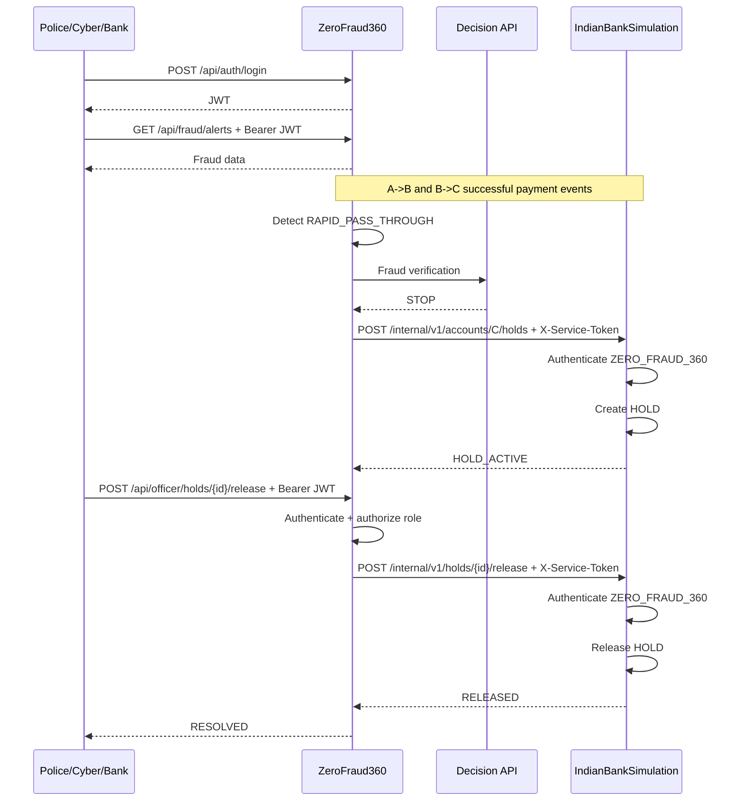

# ZeroFraud360 + IndianBankSimulation — Authentication & Secure Hold Integration

## 1. Objective

The current system contains two independent Spring Boot applications:

```text
/backend
├── IndianBankSimulation   :8080
└── ZeroFraud360           :8081
```

The fraud workflow is already verified:

```text
A -> B ₹10,000
B -> C ₹10,000 within <= 3 minutes
        |
        v
ZeroFraud360 detects RAPID_PASS_THROUGH
        |
        v
External Decision API
        |
        +--> ALLOW -> no hold
        |
        +--> STOP -> hold ₹10,000 on C
```

This phase adds authentication and authorization without breaking that workflow.

### Required security behavior

**IndianBankSimulation:**
- Normal frontend/customer APIs remain unrestricted for now, exactly as requested.
- Internal financial-control endpoints are protected.
- Only authenticated requests originating from the `ZeroFraud360` service may create/release/query financial holds.
- A browser/frontend must never be able to create or release a hold directly.

**ZeroFraud360:**
- The application is protected by Spring Security.
- Only three predefined users may log in:
  - `police`
  - `cyber`
  - `bank`
- Each has a password and role.
- Login returns a JWT access token.
- Fraud and officer APIs require authentication.
- Officer actions require a role/authority check.

This is an educational simulation. It must not be described as a production implementation of NPCI, RBI, UPI, or a real bank's private security architecture.

---

# 2. Trust Boundaries

The system has two different authentication contexts.

```text
                    HUMAN AUTHENTICATION

Police/Cyber/Bank
      |
      | username + password
      v
 ZeroFraud360
      |
      | Bearer JWT
      v
Protected ZeroFraud360 APIs
```

And separately:

```text
                  SERVICE AUTHENTICATION

ZeroFraud360 backend
      |
      | X-Service-Token
      v
IndianBankSimulation internal APIs
      |
      v
Hold / Release
```

**Never use the human JWT as the service credential.**

The desired chain is:

```text
Police user
   -> JWT -> ZeroFraud360
   -> service credential -> IndianBankSimulation
   -> HOLD/RELEASE
```

This preserves the important separation between a human user and a trusted backend service.

---

# 3. IndianBankSimulation Security Model

For this phase, do not force normal frontend users through a new login system.

Keep existing customer-facing simulation endpoints working as before.

Split endpoints into two categories.

## 3.1 Customer/simulation APIs

Examples:

```text
account lookup
balance
payment creation
payment execution	ransaction history
```

These stay accessible to the existing frontend for now.

## 3.2 Internal financial-control APIs

Protect these endpoints:

```http
POST /internal/v1/accounts/{accountId}/holds
GET  /internal/v1/holds/{holdId}
POST /internal/v1/holds/{holdId}/release
```

Only `ZeroFraud360` is allowed to execute them.

Expected behavior:

```text
Frontend without service credential -> 401/403
Wrong service token                 -> 401/403
Correct ZeroFraud360 credential     -> request allowed
```

Do not rely only on a body field such as:

```json
{"source":"ZERO_FRAUD_360"}
```

A malicious client can forge that value. Authorization must come from the authenticated service principal.

---

# 4. Existing Service Token

The existing implementation already uses:

```text
X-Service-Token: sim-secret-token-360
```

Keep the same security concept, but remove the secret from source code.

Use environment configuration instead.

Example:

```yaml
security:
  internal-service:
    expected-token: ${BANK_SIMULATION_SERVICE_TOKEN}
```

and in ZeroFraud360:

```yaml
bank-simulation:
  base-url: ${BANK_SIMULATION_BASE_URL:http://localhost:8080}
  service-token: ${BANK_SIMULATION_SERVICE_TOKEN}
```

Do not commit the actual token to Git.

Use a strong local development value.

---

# 5. Spring Security in IndianBankSimulation

Integrate the internal security into Spring Security instead of relying only on controller code.

Create/configure components similar to:

```text
security/
├── SecurityConfig
├── InternalServiceAuthenticationFilter
├── InternalServicePrincipal
└── SecurityProperties
```

The security chain should conceptually do:

```text
/internal/v1/**
    -> service authentication required

normal customer/simulation endpoints
    -> permit for this development phase
```

Create a trusted service principal such as:

```text
ZERO_FRAUD_360
```

When the valid service credential is supplied, the SecurityContext should represent that principal.

Do not log the service token.

---

# 6. ZeroFraud360 User Accounts

Create exactly three predefined users.

```text
Username: police
Role: POLICE

Username: cyber
Role: CYBER

Username: bank
Role: BANK
```

Do not implement public registration for ZeroFraud360.

Suggested development-only passwords:

```text
police -> Police@12345
cyber  -> Cyber@12345
bank   -> Bank@12345
```

These are for local/demo use only and must be clearly marked as such in the README.

**Never store plaintext passwords.**

Store a one-way password hash using BCrypt or Argon2. BCrypt is sufficient for the current version.

---

# 7. ZeroFraud360 User Schema

If no suitable existing user model exists, add:

```text
users
---------------------------
id
username UNIQUE
password_hash
role
enabled
created_at
updated_at
```

Use a controlled enum:

```text
POLICE
CYBER
BANK
```

Do not accept arbitrary role strings from a request.

---

# 8. Authentication API

Implement:

```http
POST /api/auth/login
GET  /api/auth/me
POST /api/auth/logout
```

### Login request

```json
{
  "username": "police",
  "password": "Police@12345"
}
```

### Login response

```json
{
  "accessToken": "<JWT>",
  "tokenType": "Bearer",
  "expiresIn": 3600,
  "username": "police",
  "role": "POLICE"
}
```

Never return:

```text
password
password_hash
JWT signing secret
service token
```

---

# 9. JWT

Use stateless JWT authentication for ZeroFraud360.

Recommended claims:

```json
{
  "sub": "police",
  "role": "POLICE",
  "iat": 0,
  "exp": 0
}
```

Keep claims minimal.

Do not put:

```text
account balances
UPI PINs
full customer PII
service secrets
private keys
```

in the JWT.

Configure the signing secret externally:

```yaml
security:
  jwt:
    secret: ${ZEROFRAUD_JWT_SECRET}
    expiration-seconds: ${ZEROFRAUD_JWT_EXPIRATION_SECONDS:3600}
```

Never hardcode the JWT secret.

---

# 10. Spring Security Rules in ZeroFraud360

Use a `SecurityFilterChain` with stateless authentication.

Conceptual rules:

```text
POST /api/auth/login     -> permit all
GET  /actuator/health    -> permit all
GET  /api/auth/me        -> authenticated
POST /api/auth/logout    -> authenticated (or document client-side JWT removal)
/api/fraud/**            -> authenticated
/api/officer/**          -> authenticated + role check
anything else            -> deny by default
```

Use:

```text
SessionCreationPolicy.STATELESS
```

Do not use one giant `permitAll()` rule.

---

# 11. JWT Filter

Implement a JWT authentication filter that:

```text
1. Reads Authorization header.
2. Requires Bearer scheme.
3. Validates signature.
4. Checks expiration.
5. Reads subject/role.
6. Creates Authentication.
7. Stores it in SecurityContext.
```

Invalid or expired tokens must result in:

```text
401 Unauthorized
```

Do not expose token parsing errors to clients.

---

# 12. Password Authentication

Use:

```java
passwordEncoder.matches(rawPassword, storedHash)
```

Never do:

```java
rawPassword.equals(storedPassword)
```

Use `UserDetailsService` or a clean equivalent.

Do not log submitted passwords.

---

# 13. Login Protection

Add basic failed-login protection.

Example configuration:

```yaml
security:
  login:
    max-failed-attempts: 5
    lock-duration-seconds: 300
```

A simple implementation may maintain:

```text
failed_login_attempts
locked_until
```

Do not permanently lock demo users because of accidental mistakes.

---

# 14. ZeroFraud360 Frontend

Add a login screen before allowing access to the fraud dashboard.

```text
+--------------------------------+
|          ZeroFraud360          |
|                                |
| Username                       |
| [________________________]     |
|                                |
| Password                       |
| [________________________]     |
|                                |
|          [ LOGIN ]             |
+--------------------------------+
```

After successful login:

```text
Dashboard
Fraud Alerts
Transaction Chains
Active Holds
Decision History
Officer Actions
```

Show:

```text
Logged in as: Police
Role: POLICE
```

Never show the raw JWT.

---

# 15. Frontend JWT Flow

```text
Login form
   |
   v
POST /api/auth/login
   |
   v
JWT
   |
   v
Frontend stores access token
   |
   v
Authorization: Bearer <token>
   |
   v
ZeroFraud360 protected APIs
```

If a protected API returns `401`:

```text
clear token
redirect to login
```

Do not send JWTs in query parameters.

---

# 16. Role Model

Initial roles:

```text
ROLE_POLICE
ROLE_CYBER
ROLE_BANK
```

For this phase all three roles may read:

```text
GET /api/fraud/alerts
GET /api/fraud/alerts/{alertId}
GET /api/fraud/transactions
GET /api/fraud/chains/{accountId}
```

Officer endpoints should use explicit role checks even if all three are temporarily permitted. That allows policy to be tightened later without changing the API structure.

Do not use username comparisons such as:

```java
if (username.equals("police"))
```

Use authorities/roles.

---

# 17. Human Authentication vs Service Authentication

This distinction is mandatory.

### Human JWT

```text
Police/Cyber/Bank
       |
       | Bearer JWT
       v
ZeroFraud360 API
```

### Service credential

```text
ZeroFraud360 backend
       |
       | X-Service-Token
       v
IndianBankSimulation internal API
```

Never forward:

```text
Authorization: Bearer <police JWT>
```

to IndianBankSimulation as proof that the caller is ZeroFraud360.

The bank simulation should trust only its configured service credential.

---

# 18. Hold API Security

Current endpoints:

```http
POST /internal/v1/accounts/{accountId}/holds
GET  /internal/v1/holds/{holdId}
POST /internal/v1/holds/{holdId}/release
```

Required authentication:

```text
ZERO_FRAUD_360 service principal
```

Customer/frontend authentication must not be sufficient.

The server must establish caller identity from the service authentication filter.

---

# 19. Hold Request Example

ZeroFraud360 should continue to send a request similar to:

```json
{
  "requestId": "HOLD-ALERT-123",
  "transactionId": "TXN-002",
  "amount": 10000,
  "currency": "INR",
  "durationMinutes": 10,
  "reasonCode": "FRAUD_ALERT",
  "source": "ZERO_FRAUD_360",
  "alertId": "ALERT-123"
}
```

The `source` field is informational only. The authorization decision must come from the authenticated service principal.

---

# 20. Hold Must Remain a Financial Lock, Not a Debit

If Account C has:

```text
Ledger balance = ₹20,000
Held amount    = ₹10,000
```

then:

```text
Available balance = ₹10,000
```

The hold must not subtract another ₹10,000 from the ledger.

Correct:

```text
ledgerBalance = 20,000
heldAmount = 10,000
availableBalance = 10,000
```

After release:

```text
ledgerBalance = 20,000
heldAmount = 0
availableBalance = 20,000
```

---

# 21. ZeroFraud360 Officer Action

The existing officer endpoint should be protected by JWT + role:

```http
POST /api/officer/holds/{holdId}/release
```

Flow:

```text
Police/Cyber/Bank
       |
       | JWT
       v
ZeroFraud360
       |
       | authenticate user
       | authorize role
       v
HoldCoordinator
       |
       | X-Service-Token
       v
IndianBankSimulation
       |
       v
Release Hold
```

Record the human identity in ZeroFraud360's audit trail.

---

# 22. Officer Audit

When a hold is released, record:

```text
username
role
holdId
alertId
transactionId
reason
result
timestamp
correlationId
```

The downstream BankSimulation request should identify the trusted service as:

```text
ZERO_FRAUD_360
```

This creates a traceable chain:

```text
Police user
 -> ZeroFraud360
 -> ZERO_FRAUD_360 service
 -> IndianBankSimulation
```

---

# 23. Existing Fraud Flow Must Not Change

After authentication, the original fraud workflow must still be:

```text
A -> B ₹10,000
        |
        v
B -> C ₹10,000 within <= 3 minutes
        |
        v
PAYMENT_SUCCESS events
        |
        v
ZeroFraud360
        |
        v
RAPID_PASS_THROUGH
        |
        v
Decision API
        |
        v
STOP
        |
        v
authenticated service request
        |
        v
IndianBankSimulation
        |
        v
Account C HOLD
```

Authentication is an added security layer, not a replacement for the fraud logic.

---

# 24. CORS

Configure CORS explicitly for the frontend development origins.

Do not blindly use:

```text
Access-Control-Allow-Origin: *
```

for credential-sensitive browser flows.

The exact frontend origin must be discovered from the existing projects before configuration is written.

---

# 25. CSRF

Because ZeroFraud360 is intended to use stateless Bearer JWTs in the Authorization header, configure CSRF based on that architecture and document the decision.

Do not disable security features without explaining why.

IndianBankSimulation's normal customer APIs are currently an educational simulation and are not being converted to a login-protected customer session in this phase.

---

# 26. Secrets

All secrets must be externalized.

Required configuration examples:

```text
ZEROFRAUD_JWT_SECRET
BANK_SIMULATION_SERVICE_TOKEN
BANK_SIMULATION_BASE_URL
FRAUD_DECISION_API_URL
DB credentials
```

Create:

```text
.env.example
```

with placeholders only.

Example:

```text
ZEROFRAUD_JWT_SECRET=REPLACE_ME
BANK_SIMULATION_SERVICE_TOKEN=REPLACE_ME
BANK_SIMULATION_BASE_URL=http://localhost:8080
FRAUD_DECISION_API_URL=http://localhost:XXXX
```

Never commit real values.

---

# 27. Audit and Logging Security

### ZeroFraud360 audit events

```text
LOGIN_SUCCESS
LOGIN_FAILURE
FRAUD_ALERT_VIEWED
HOLD_REQUESTED
HOLD_RESPONSE_RECEIVED
OFFICER_RELEASE_REQUESTED
OFFICER_RELEASE_COMPLETED
OFFICER_RELEASE_FAILED
```

### IndianBankSimulation audit events

```text
INTERNAL_HOLD_REQUEST
INTERNAL_HOLD_CREATED
INTERNAL_HOLD_RELEASE_REQUEST
INTERNAL_HOLD_RELEASED
INTERNAL_HOLD_REJECTED
```

Never log:

```text
password
UPI PIN
password hash
JWT
JWT secret
service token
DB password
Authorization header
```

---

# 28. Correlation IDs

Continue using:

```text
X-Correlation-Id
```

Track the full chain:

```text
correlationId
transactionId
alertId
decisionRequestId
holdRequestId
```

Example:

```text
CORR-FRAUD-001
    |
    +-- TXN-002
    |
    +-- ALERT-123
    |
    +-- DEC-123
    |
    +-- HOLD-9001
```

---

# 29. Idempotency Must Survive Authentication Changes

Do not break the existing idempotency behavior.

For payment events:

```text
eventId + consumerName
```

For fraud alerts:

```text
patternType + firstTransactionId + secondTransactionId
```

For holds:

```text
HOLD-{alertId}
```

A retry must not create:

```text
2 alerts
2 holds
2 financial mutations
```

---

# 30. Security Test Matrix

Mandatory tests:

| Test | Expected |
|---|---|
| Police correct login | 200 + JWT |
| Cyber correct login | 200 + JWT |
| Bank correct login | 200 + JWT |
| Wrong password | 401 |
| Unknown user | 401 |
| Fraud API without JWT | 401 |
| Fraud API invalid JWT | 401 |
| Fraud API expired JWT | 401 |
| Fraud API with Police JWT | 200 |
| Fraud API with Cyber JWT | 200 |
| Fraud API with Bank JWT | 200 |
| Hold API without service token | 401/403 |
| Hold API wrong service token | 401/403 |
| Hold API from frontend | 401/403 |
| Hold API with valid ZeroFraud360 service token | success |
| Release API without service token | 401/403 |
| Release API with valid service token | success |
| Duplicate hold request | one hold |
| Officer release with valid ZeroFraud360 JWT | success |
| Unauthorized role | 403 when role restriction applies |

---

# 31. Direct Frontend Hold Attack Test

Simulate:

```http
POST http://localhost:8080/internal/v1/accounts/ACC-C/holds
```

without a service credential.

Expected:

```text
401 / 403
no hold created
```

Then:

```text
X-Service-Token: wrong-value
```

Expected:

```text
401 / 403
no hold created
```

Then a valid service credential:

```text
X-Service-Token: <configured secret>
```

Expected:

```text
hold created
```

---

# 32. Direct Frontend Release Attack Test

Attempt:

```http
POST /internal/v1/holds/{holdId}/release
```

from the frontend without the service credential.

Expected:

```text
401/403
hold remains ACTIVE
```

---

# 33. Full End-to-End Authentication Test

Create a test covering the complete chain.

```text
1. Login as police.
2. Receive JWT.
3. Call ZeroFraud360 protected API successfully.
4. Execute A -> B ₹10,000.
5. Execute B -> C ₹10,000 within 60 seconds.
6. ZeroFraud360 consumes both PAYMENT_SUCCESS events.
7. RapidPassThroughRule detects the chain.
8. FraudAlert is created.
9. Decision API returns STOP.
10. ZeroFraud360 sends an authenticated internal request.
11. IndianBankSimulation verifies ZERO_FRAUD_360 service identity.
12. Account C receives a ₹10,000 hold.
13. Verify ledger balance is unchanged.
14. Verify available balance decreases by ₹10,000.
15. Police calls officer release using JWT.
16. ZeroFraud360 authorizes the role.
17. ZeroFraud360 sends authenticated service release request.
18. BankSimulation releases the hold.
19. Fraud alert becomes RESOLVED.
20. Audit trail contains police identity and service identity.
```

---

# 34. Existing Regression Tests

After adding authentication, re-run the existing suites.

### IndianBankSimulation

Current baseline:

```text
15 tests
0 failures
0 errors
BUILD SUCCESS
```

### ZeroFraud360

Current baseline:

```text
6 tests
0 failures
0 errors
BUILD SUCCESS
```

The security phase must preserve the previously verified scenarios:

```text
testPaymentsAtoBtoC
testHoldReducesAvailableBalanceAndBlocksOverdraft
testHoldTokenValidation
testEndToEndFraudDetectionAndHoldWorkflow
testEventIngestionIdempotency
testDetectsRapidPassThroughWithin60Seconds
testRejectsExceeding3Minutes
testRejectsDifferentAmount
```

The test count may increase because of new security tests.

---

# 35. Package Structure — ZeroFraud360

Use a clean structure such as:

```text
auth/
├── controller/
├── service/
├── security/
├── domain/
├── repository/
└── dto/

fraud/
├── domain/
├── rule/
├── service/
└── repository/

alert/
├── domain/
├── service/
├── repository/
└── controller/

decision/
├── client/
├── service/
├── domain/
└── repository/

hold/
├── client/
├── service/
├── domain/
└── repository/

integration/
├── banksimulation/
└── externaldecision/

officer/
├── controller/
└── service/
```

Do not put all logic into controllers.

---

# 36. Package Structure — IndianBankSimulation

Add/extend:

```text
security/
├── SecurityConfig
├── InternalServiceAuthenticationFilter
├── InternalServicePrincipal
└── SecurityProperties
```

Reuse the existing:

```text
HoldService
InternalHoldController
AccountService
PaymentService
```

instead of rewriting the financial domain.

---

# 37. No Business Logic in Security Filters

Security filters should answer:

```text
Who is calling?
Is this request authenticated?
Is the caller permitted?
```

They must NOT:

```text
create holds
release holds
change balances
run fraud rules
call the Decision API
```

Keep those operations in domain/application services.

---

# 38. Authentication Error Model

Use a consistent response.

Example:

```json
{
  "timestamp": "2026-09-10T05:30:00Z",
  "status": 401,
  "code": "UNAUTHORIZED",
  "message": "Authentication is required.",
  "correlationId": "CORR-123"
}
```

Invalid credentials should remain generic:

```json
{
  "status": 401,
  "code": "INVALID_CREDENTIALS",
  "message": "Invalid username or password.",
  "correlationId": "CORR-123"
}
```

Do not reveal whether the username exists.

---

# 39. Internal-Service Error Model

Invalid service credential:

```json
{
  "status": 401,
  "code": "INVALID_SERVICE_CREDENTIAL",
  "message": "The internal service credential is invalid.",
  "correlationId": "CORR-123"
}
```

Never reveal the expected secret.

---

# 40. Hold Expiration

The existing 10-minute hold behavior must continue to work.

Do not use an in-memory timer that would disappear after restart.

Persist:

```text
createdAt
expiresAt
status
releasedAt
releaseReason
```

A scheduled task may periodically execute:

```text
find ACTIVE holds where expiresAt <= now
release/expire them safely
```

Make the scheduler interval configurable.

---

# 41. Hold Concurrency

Authentication must not remove financial concurrency guarantees.

When a hold is created concurrently with a payment attempt, available-balance checks must remain atomic/consistent according to the existing account-locking strategy.

The system must not allow a customer to spend held funds because a hold and transfer request arrived at nearly the same time.

Reuse the existing versioning/locking strategy where possible.

---

# 42. Development Environment

Expected local configuration:

```text
IndianBankSimulation :8080
ZeroFraud360         :8081
Decision API         :XXXX
```

Keep the Decision API port configurable.

Keep BankSimulation URL configurable.

Do not hardcode the final Decision API port.

---

# 43. Suggested `.env.example`

```text
# ZeroFraud360
ZEROFRAUD_JWT_SECRET=REPLACE_ME
ZEROFRAUD_JWT_EXPIRATION_SECONDS=3600

# IndianBankSimulation internal security
BANK_SIMULATION_SERVICE_TOKEN=REPLACE_ME

# Integration
BANK_SIMULATION_BASE_URL=http://localhost:8080
FRAUD_DECISION_API_URL=http://localhost:XXXX
```

Add `.env` to `.gitignore`.

---

# 44. Documentation Updates

Update:

```text
ZeroFraud360/README.md
ZeroFraud360/SECURITY.md
ZeroFraud360/INTEGRATION.md
IndianBankSimulation/README.md
```

Document:

```text
three ZeroFraud360 users
login flow
JWT flow
service authentication
hold endpoint security
frontend restrictions
environment variables
local startup
security tests
```

Clearly label demo credentials as development-only.

---

# 45. Mermaid Security Sequence Diagram

Add this to the architecture documentation:



---

# 46. Implementation Order

Implement in exactly this order.

## Step 1 — Inspect Existing Code

Before writing code, inspect both Spring Boot applications.

Check:

```text
Spring Boot version
Java version
pom.xml dependencies
existing security classes
existing entities
existing controllers
existing payment flow
existing hold flow
existing Flyway migrations
existing test suite
existing frontend origins
existing configuration
```

Do not overwrite working code.

## Step 2 — ZeroFraud360 Database User Model

Add:

```text
users
roles if necessary
seed three accounts
```

## Step 3 — ZeroFraud360 Authentication

Implement:

```text
Password hashing
UserDetailsService
AuthenticationManager
JWT service
JWT filter
SecurityFilterChain
login API
/me API
```

## Step 4 — Protect APIs

Protect:

```text
/api/fraud/**
/api/officer/**
```

and leave login/health public as appropriate.

## Step 5 — ZeroFraud360 Frontend Login

Add:

```text
login screen
protected routes
JWT attachment
logout
401 handling
```

## Step 6 — IndianBankSimulation Service Authentication

Move the existing service token into environment configuration.

Add Spring Security protection for internal financial-control APIs.

Do NOT restrict the existing frontend/customer APIs.

## Step 7 — Service-to-Service Client

Make ZeroFraud360 send:

```text
X-Service-Token
```

from configuration whenever it calls internal hold/release APIs.

## Step 8 — Officer Release Authorization

Require:

```text
valid ZeroFraud360 JWT
+
allowed role
```

Then call the bank simulation with service authentication.

## Step 9 — Security Tests

Add all authentication, authorization, direct-attack, and end-to-end tests.

## Step 10 — Regression Tests

Run both existing application test suites.

## Step 11 — Documentation

Document the final security architecture.

---

# 47. AI Coding-Agent Instructions

When implementing this specification:

1. Read this entire file before modifying code.
2. Inspect both applications before writing anything.
3. Do not guess package names or class names.
4. Preserve all existing payment/fraud functionality.
5. Reuse existing domain services where possible.
6. Do not merge the two Spring Boot applications.
7. Do not let ZeroFraud360 access the BankSimulation database directly.
8. Keep frontend access to normal BankSimulation APIs unrestricted in this phase.
9. Protect only the required internal financial-control endpoints there.
10. Seed exactly three ZeroFraud360 users: police, cyber, bank.
11. Do not implement ZeroFraud360 public registration.
12. Hash passwords.
13. Use JWT for ZeroFraud360 human authentication.
14. Keep service-to-service authentication separate from human JWT authentication.
15. Never forward the user's JWT as a BankSimulation service credential.
16. Move internal service secrets into environment configuration.
17. Never hardcode credentials or secrets.
18. Never log passwords, PINs, JWTs, service tokens, or signing secrets.
19. Do not put business logic into security filters/controllers.
20. Keep hold creation/release idempotent.
21. Keep audit trails.
22. Use DTOs instead of exposing entities directly.
23. Preserve transaction boundaries and concurrency controls.
24. Do not replace the existing fraud rule with a new one.
25. Do not add SMS/email/push notifications in this phase.
26. Do not add ML/AI fraud detection in this phase.
27. Do not integrate with real NPCI/RBI/banks.
28. Mark simulation-only behavior clearly.
29. Run tests after each major change.
30. If an existing implementation conflicts with this document, inspect and explain the conflict before changing behavior.

---

# 48. Definition of Done

## ZeroFraud360

```text
[ ] Spring Security integrated
[ ] Three predefined users
[ ] Passwords hashed
[ ] JWT login
[ ] /api/auth/me
[ ] Protected fraud APIs
[ ] Protected officer APIs
[ ] Role checks
[ ] Invalid credentials rejected
[ ] Invalid/expired tokens rejected
[ ] Login audit
```

## IndianBankSimulation

```text
[ ] Spring Security integrated
[ ] Normal frontend/customer APIs remain accessible
[ ] Internal hold APIs protected
[ ] Internal release APIs protected
[ ] Valid service credential required
[ ] Wrong/missing service credential rejected
[ ] Service token comes from environment
[ ] No hardcoded secret
```

## Integration

```text
[ ] ZeroFraud360 -> BankSimulation authenticated
[ ] STOP -> HOLD still works
[ ] Officer JWT -> release works
[ ] Duplicate hold remains idempotent
[ ] Existing payment tests pass
[ ] Existing fraud tests pass
[ ] Direct frontend hold attack fails
[ ] Direct frontend release attack fails
[ ] End-to-end security/fraud test passes
```

---

# 49. Final Target Architecture

```text
                     ┌──────────────────────┐
                     │ IndianBank Frontend  │
                     └──────────┬───────────┘
                                │
                                │ normal APIs
                                v
                    ┌────────────────────────┐
                    │ IndianBankSimulation   │
                    │ :8080                  │
                    │                        │
                    │ Accounts               │
                    │ Payments               │
                    │ Ledger                 │
                    │ Holds                  │
                    └───────────▲────────────┘
                                │
                     service authentication
                                │
                                │
                    ┌───────────┴────────────┐
                    │      ZeroFraud360      │
                    │       :8081            │
                    │                        │
                    │ JWT Authentication    │
                    │ Fraud Detection        │
                    │ Alert Engine           │
                    │ Decision Client        │
                    │ Hold Coordinator       │
                    │ Officer APIs           │
                    └──────────┬─────────────┘
                               │
                    username/password + JWT
                               │
               ┌───────────────┼────────────────┐
               │               │                │
               v               v                v
            POLICE           CYBER             BANK
```

The fundamental security rule for this phase is:

> **Humans authenticate to ZeroFraud360. ZeroFraud360 authenticates to IndianBankSimulation. Frontend users never receive direct authority to manipulate financial holds.**

The next phase may later add full customer authentication to IndianBankSimulation, but that must be a separate change and must not be implemented as part of this phase.
