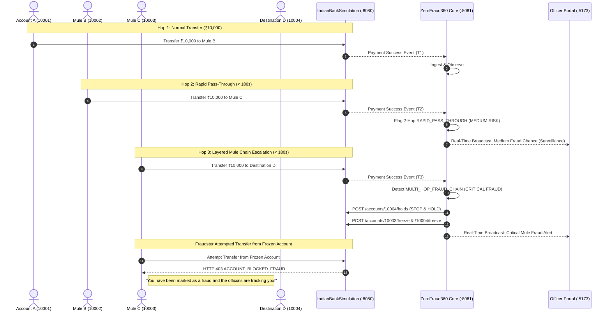

<div align="center">


# ZeroFraud360
### Autonomous Real-Time Interbank Fraud Interception & Money-Mule Prevention Engine
**Smart India Hackathon (SIH) 2026 | Domain: Financial Fraud & Cyber Security**

[](https://openjdk.org/)
[](https://spring.io/projects/spring-boot)
[](https://fastapi.tiangolo.com/)
[](https://react.dev/)
[](https://www.typescriptlang.org/)
[](https://vitejs.dev/)
[](https://www.mysql.com/)
[](https://tailwindcss.com/)

<p align="center">
  <b>Shifting banking defense from reactive post-mortem reporting to proactive, sub-second pre-hold intervention.</b>
</p>

[Key Features](#-key-features) •
[Architecture](#-system-architecture) •
[Fraud Detection Workflow](#-multi-hop-fraud-detection-workflow) •
[Account Forensics](#-account-forensics--geolocation-intelligence) •
[Quick Start](#-quick-start--orchestration) •
[Team & Hackathon](#-smart-india-hackathon-2026)

---

</div>

## 📌 Executive Summary

Modern cyber fraud syndicates exploit instantaneous payment rails (UPI, IMPS, RTGS) to layer stolen funds through automated multi-hop **money mule networks** within seconds. By the time a victim lodges a cyber-cell complaint or a compliance officer inspects the transaction, the illicit funds have already been liquidated at physical ATMs or off-ramped.

**ZeroFraud360** is an enterprise-grade, real-time banking fraud detection and automated hold enforcement platform. It monitors transactions in flight, applies complex graph-layering rules and AI risk scoring, detects multi-hop mule forwarding chains across independent simulated banks (State Bank of India, HDFC Bank, ICICI Bank), and automatically places internal holds and account freezes **before** the fraudulent funds can exit the banking perimeter.

---

## 🚨 Key Features

- **⚡ Sub-Second In-Flight Surveillance**: Evaluates every payment transaction in real time through transactional outbox event streams.
- **🕸️ Multi-Hop Money Mule Chain Detection**:
  - **Hop 1 ($A \rightarrow B$)**: Legitimate transfer processed normally.
  - **Hop 2 ($B \rightarrow C$)**: Rapid pass-through flagged as **Medium Fraud Chance** for officer surveillance without locking accounts.
  - **Hop 3 ($C \rightarrow D$)**: Escalated to **Critical Multi-Hop Fraud**, triggering an automated **STOP & HOLD** command.
- **🔒 Automated Interbank Account Freeze**: Directly locks source, intermediary, and destination mule accounts across participating banking cores in real time.
- **📱 Real-Time In-App Fraud Tracking Warning**: Any transfer attempt from a frozen account is intercepted with an HTTP 403 alert:
  > *"You have been marked as a fraud and the officials are tracking you!"*
- **📍 Account Forensics & Geolocation Intelligence**:
  - Interactive multi-channel withdrawal breakdown (ATM cash, UPI, POS merchant, NetBanking, branch counter).
  - Physical terminal mapping (terminal IDs, branches, and GPS coordinates across Indian cities).
  - **Geo-Velocity & Impossible Travel Anomaly Detection** (detecting cloned cards or distributed cashout rings).
- **🛡️ Officer Clearance & Pattern Registry**:
  - **Clear False Positive**: Instantly releases holds and restores accounts to `ACTIVE`.
  - **Confirm Fraud**: Permanently blocks funds and stores the mule network signature in the Fraud Pattern Registry.
- **🛠️ Hidden Developer Control Studio (`/developer`)**: One-click database wipe, account unfreezing, and automated video scenario triggers.
- **📱 True Cross-Device & Mobile Access**: Fully responsive UI accessible over LAN Wi-Fi or public tunnels for mobile phones.

---

## 🏛️ System Architecture

ZeroFraud360 is built as a reactive, event-driven microservices ecosystem:

```mermaid
flowchart TB
    subgraph Clients["Presentation Layer"]
        BS_UI["📱 Bank Simulator UI<br/>(React 19 + Vite - Port 3000)"]
        ZF_UI["🛡️ ZeroFraud360 Portal<br/>(React 19 + TypeScript - Port 5173)"]
    end

    subgraph CoreBanking["Simulated Banking Core"]
        IBS["🏦 IndianBankSimulation<br/>(Spring Boot 3.4 - Port 8080)"]
        DB_BANK[("🗄️ banksim_db<br/>(MySQL 8.4)")]
        IBS --- DB_BANK
    end

    subgraph FraudEngine["Fraud Intelligence & Enforcement"]
        ZF_CORE["🧠 ZeroFraud360 Core Engine<br/>(Spring Boot 3.4 - Port 8081)"]
        ML["🤖 ML Brain Decision API<br/>(FastAPI / Python 3.12 - Port 8000)"]
        DB_ZF[("🗄️ zerofraud360_db<br/>(MySQL 8.4)")]
        ZF_CORE --- DB_ZF
        ZF_CORE <-->|REST / JWT| ML
    end

    BS_UI <-->|REST Transfers| IBS
    ZF_UI <-->|REST / JWT| ZF_CORE
    IBS -->|Outbox Events (Payment Success)| ZF_CORE
    ZF_CORE -->|Hold / Freeze / Unfreeze| IBS
```

### Component Breakdown:
| Service | Technology | Port | Purpose |
|---|---|---|---|
| **IndianBankSimulation** | Spring Boot, Spring Security, JPA | `8080` | Simulates multi-bank accounts (SBI, HDFC, ICICI), balances, transfers, and account freezing. |
| **ZeroFraud360 Core** | Spring Boot, Flyway, RestClient | `8081` | Complex event processing, rapid pass-through rule engine, alert management, and forensics. |
| **ML_BRAIN** | Python 3.12, FastAPI, XGBoost | `8000` | AI anomaly scoring, pattern verification, and biometric/channel deviation models. |
| **ZeroFraud360 Portal** | React 19, TypeScript, TailwindCSS | `5173` | Compliance Officer Defense Center, Live Risk Dashboard, Pattern Registry, and Forensics. |
| **Bank Simulator UI** | React 19, Vite, Lucide Icons | `3000` | Mobile-responsive customer banking app with 5-digit accounts, PIN auth, and fraud tracking alerts. |

---

## 🔄 Multi-Hop Fraud Detection Workflow



---

## 🔍 Account Forensics & Geolocation Intelligence

Officers can click **Account Forensics** in the portal and select any simulated account (`10001` - `10006`) to view:

1. **Live Profile & AML Score**: Real-time status (`ACTIVE` vs `FROZEN`), available balance, and risk rating (`0 - 100`).
2. **Withdrawal Mode Breakdown**:
   - **ATM Cash Withdrawal**: Total amount, transaction count, percentage distribution, and average withdrawal size.
   - **UPI Instant Transfer**: Live debit transfers from bank simulation and historical flows.
   - **Point of Sale (POS) Merchant Debit**: Retail shopping and merchant debits.
   - **NetBanking / IMPS Transfer**: Online portal transfers and utility payments.
   - **Branch Counter Cash Withdrawal**: Teller cash cheque withdrawals.
3. **Specific Physical Locations & Terminals**:
   - Maps physical terminals across **Chennai, Bengaluru, Mumbai, Coimbatore, Delhi, and Hyderabad**.
   - Details terminal IDs (`ATM-SBI-CHN-042`, `POS-BLR-054`), GPS coordinates, and total amounts withdrawn.
4. **Geographic Velocity & Impossible Travel Anomaly Detection**:
   - Flags rapid cross-city movements (e.g., ATM withdrawal in Mumbai followed by Chennai within 45 minutes).
   - Computes distance, time gap, and velocity, alerting officers of cloned cards or distributed cashout syndicates.

---

## 🚀 Quick Start & Orchestration

### Prerequisites
- **Java**: JDK 21+
- **Node.js**: v18+ & npm
- **Python**: 3.10+ (with `pip install -r ML_BRAIN/requirements.txt`)
- **MySQL Server**: 8.4 running on `localhost:3306` with user `root` / `root`

### 1. Launch All Services (One Click)
Run the master orchestrator script from the repository root:

```cmd
.\start-all.bat
```
*(Or via PowerShell: `powershell -ExecutionPolicy Bypass -File .\start-all.ps1`)*

This starts all 5 services simultaneously:
- **Bank Simulator UI**: `http://localhost:3000`
- **ZeroFraud360 Officer Portal**: `http://localhost:5173`
- **IndianBankSimulation Backend**: `http://localhost:8080`
- **ZeroFraud360 Core Backend**: `http://localhost:8081`
- **ML_BRAIN AI API**: `http://localhost:8000/docs`

### 2. Mobile & Remote Wi-Fi Access
Connect your smartphone to the same Wi-Fi network as your laptop:
- **Banking Simulator on Mobile**: `http://<YOUR_LAPTOP_IP>:3000`
- **Officer Dashboard on Mobile**: `http://<YOUR_LAPTOP_IP>:5173`

### 3. Stop All Services (One Click)
```cmd
.\stop-all.bat
```

---

## 🔑 Pre-Configured Credentials

### Compliance Officer Portal (`http://localhost:5173`):
| Username | Password | Role | Permissions |
|---|---|---|---|
| `bank` | `Bank@12345` | `ROLE_BANK` | Bank Compliance Officer (Holds, Alerts, Forensics, Clearance) |
| `police` | `Police@12345` | `ROLE_POLICE` | Cyber Crime Police Officer (Surveillance, Freezes) |
| `cyber` | `Cyber@12345` | `ROLE_CYBER` | Cyber Cell Intelligence Analyst |

### Simulated Bank Accounts (`http://localhost:3000`):
| Account Number | Customer Name | Bank Name | Initial Balance | UPI PIN |
|---|---|---|---|---|
| `10001` | Muthukumaran M | State Bank of India (`BANK_A`) | ₹78,500 | `1234` |
| `10002` | Naveen K | HDFC Bank (`BANK_B`) | ₹42,300 | `1234` |
| `10003` | Yogeshwaran V | ICICI Bank (`BANK_C`) | ₹65,200 | `1234` |
| `10004` | Kanika | State Bank of India (`BANK_A`) | ₹34,800 | `1234` |
| `10005` | Nithiya | HDFC Bank (`BANK_B`) | ₹56,700 | `1234` |
| `10006` | Elamathi | ICICI Bank (`BANK_C`) | ₹89,400 | `1234` |

---

## 🛠️ Developer Control Studio (`/developer`)

During live demonstrations or video recordings, enter **`http://localhost:5173/developer`** directly in the browser address bar to access the hidden **Developer Control Center**:
- **One-Click System Reset**: Completely purges transactions and alerts, unfreezes accounts, and restores default balances.
- **Unfreeze All Accounts**: Instantly unlocks all accounts across banks.
- **Interactive Scenario Triggers**:
  - *Trigger Hop 1*: `10001` $\rightarrow$ `10002` (Normal).
  - *Trigger Hop 2*: `10002` $\rightarrow$ `10003` (Medium Risk Surveillance).
  - *Trigger Hop 3*: `10003` $\rightarrow$ `10004` (Critical Fraud Escalation & Instant Freeze).
- **Live Account Inspector**: Real-time balance and status monitoring across all accounts.

---

## 🏆 Smart India Hackathon 2026

- **Project Name**: ZeroFraud360
- **Domain**: Financial Fraud Detection / Banking Security / Cyber Defense
- **Target Institutions**: Reserve Bank of India (RBI), Indian Cyber Crime Coordination Centre (I4C), Commercial & Private Banks

<div align="center">
  <sub>Built with ❤️ for Smart India Hackathon 2026</sub>
</div>